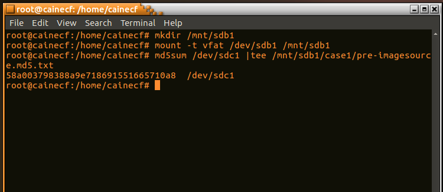

---
title: "CSC153: Activity 3 - Linux Data Acquisition"
author: Ryan Kozak
date: "2019-09-22"
subject: "CSC153 Activity 3"
keywords: [CSUS, CSC153, Data Acquisition]
lang: "en"
titlepage: true
titlepage-text-color: "FFFFFF"
titlepage-color: "004E36"
titlepage-rule-color: "C4B581"
logo: "./images/csus.png"
logo-width: 150
...

# Activity 3: Linux Data Acquisition
### CSC 153 - Computer Forensics Principles and Practice

## Part 1: Preparing The Target Drive

First we open up the terminal and issue the `su` command to login as root. We then issue the `fdisk -l` command to show the current disks.

  
\ **Figure 1:** Current disks, no flash drives plugged in.

Now we plug the target USB drive into the system and issue `fdisk -l` once more. This time `/dev/sdb` appears, which is our target drive.

  
\ **Figure 2:** Current disks, with target drive plugged in.

It is now time we zero out the target drive to ensure that absolutely no data is on it when we use it to make a copy of our evidence drive. The target drive is zeroed out via `dd if=/dev/zero of=/dev/sdb`.  

**Note:** Because it was taking so long to zero out a drive of only 1Gb, I decided to add the `status=progress` option to the command. Knowing the progress prevented me from thinking things were hanging.

  
\ **Figure 3:** Zeroing out target drive with dd.

We then create a new partition table on the target drive by issuing `fdisk /dev/sdb`, selecting `n` for new partition, and `p` for primary. This partition is to be the first partition on the drive, so `1` is entered.

  
\ **Figure 4:** Creating new partition on target drive.

The next step is changing the partition to Windows 95 FAT32. To do so we navigate to the menu, select `t` to change the partition type, and view the available file systems via `l`. We'll select `c` for Windows 95 FAT32(LBA). Changes are written to the drive via `w`.

  
\ **Figure 5:** Changing the partition to Windows 95 FAT32.

Lastly, we format a FAT file system from Linux by issuing `mkfs.msdos -vF32 /dev/sdb1`.

  
\ **Figure 6:** Formatting a FAT file system.

## Part 2: Perform Data Acquisition

Now we plug our evidence drive into the system, and issue `fdisk -l` to determine where that is at as well.

  
\ **Figure 7:** Evidence drive is `/dev/sdc1` in this case.

The next step is to mount our target drive by creating a directory `/mnt/sdb1` and issuing the command `mount -t vfat /dev/sdb1 /mnt/sdb1`. We then create a directory `case1` and calculate the md5sum of the evidence drive, saving it into this new directory. The hash is calculated via `md5sum /dev/sdc1 |tee /mnt/sdb1/case1/pre-imagesource.md5.txt`.

We're ready to acquire data from the evidence drive. We do so via `dcfldd if=/dev/sdc1 of=/mnt/sdb1/case1/image1.dd conv=noerror,sync hash=md5 hashwindow=0 hashlog=/mnt/sdb1/case1/post-imagesource.md5.txt`.

  
\ **Figure 8:** Verification of acquired data.

**Note:** The flash drive on which I setup to copy the evidence was the exact same size as the evidence drive. This created an issue for me, as there wasn't enough space. I used the `/tmp` folder to save `image1.dd` and its hash. This went fine. Next time I will bring a larger drive to copy my evidence.

See Figure 8 below for console output.

## Part 3: Validate The Acquired Data

Now it's time to validate our aquired data. We can do this via **dcfldd** via the command `dcfldd if=/dev/sdc1 split=2M of=/tmp/image1.dd conv=noerror,sync hash=md5 hashwindow=0 hashlog=/tmp/post-imagesource.md5.txt`. We can also verify it using the md5 sums we've generated. Each method is used in figure 8 below.

  
\ **Figure 9:** Verification of acquired data.

## Post-Activity Questions

1. What are the two broad categories of acquisition?
 	  * Static Acquisition.
    * Live Acquisition.

2. What is a live storage acquisition and when is it used?
    * Data is collected from the local computer or over a network while running. Not repeatable because data continually being altered by the OS.
    * Used when a computer cannot be shut down.

3. Which command should be used to check the disks available on the current system? You only need to state the command name, not the entire command string.
    * fdisk is used, `fdisk -l`.

4. The `mkfs -t` command does what?
    * Makes a file system of a certain type.

5. Which drive should be 'zeroed out', the source evidence drive or the target drive?
    * The target drive.

6. What is the purpose of 'zeroing out' before a storage acquisition is performed?
    * To ensure there is actually absolutely nothing on the drive. Such as software/malware from the vendor that may effect evidence.

7. When you issue the command the command `dd if=/dev/zero of=/dev/sdb`, What does the string `/dev/sdb` represent?
    * This command zeroes out the target drive, before we copy evidence to it. So, `/dev/sdb` represents the target drive.

8. The `md5sum /dev/sda` command does what? Why is it used?
    * This command would generate a hash of the drive on which CAINE is installed. I think this question intended to say `/dev/sdc`? We do this to create a hash of the evidence before we copy it, to compare with the hash of our copy to validate that they're the same.

9. How many times should the md5sumcommand be used at least in one acquisition?
  	* Once for the pre-image source when we hash the evidence drive.
    * Once for the post-image source when we hash our image after acquisition.

10. Instead of using “dd”, what other commands can you use to perform data acquisition in Linux?
    * You can use *dcfldd*, if it's installed, which is the DoD's enhanced version of *dd*.
