# Activity 4: Basic Forensic Analysis using Autopsy
### CSC 153 - Computer Forensics Principles and Practice

## Scenario
Last week University police arrested a student, Billy Badguy, for selling cocaine. During the pursuit the student threw a USB drive into a storm drain. The Office of the Physical Plant (OPP) was contacted and they were able to recover the USB drive. The Police department has asked you to perform a forensic analysis on this USB drive. You have created an image and left it on your desktop. When you open the USB with your own machine, you’ll see that only two files are shown in the USB: `boring.jpg` and `where were you.mp3`. Your task is to reveal more information by analyzing the image.

### Tasks 0 through 2
Below are the steps taken to create a case and investigate the suspect's drive using Autopsy.

Download the image of suspect’s drive, open Autopsy.  
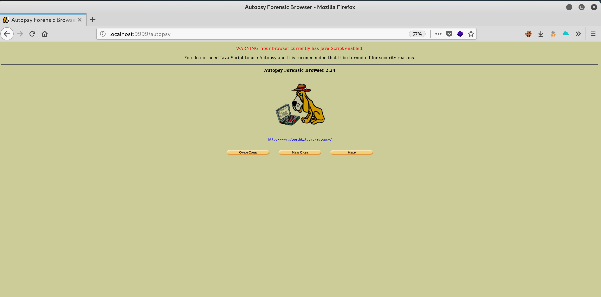
**Figure 1:** Open Autopsy browser.

Create a new case to begin our investigation.  
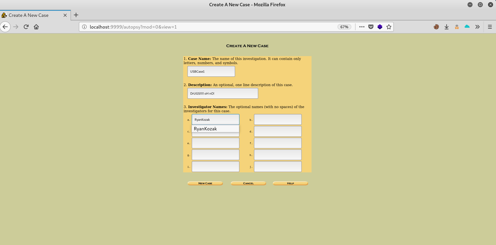
**Figure 2:** Create a new case.

Add a new host.  
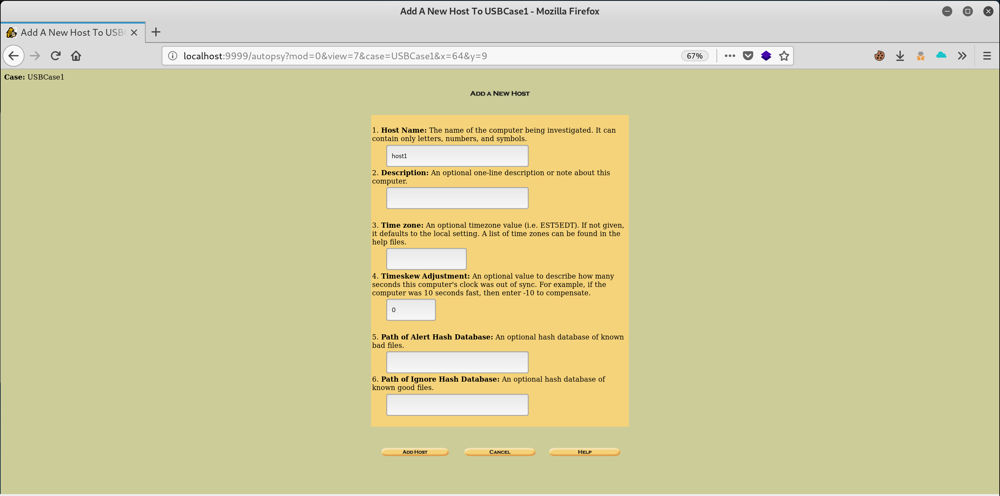
**Figure 3:** Add host.

Adding an image of the suspect's drive.  
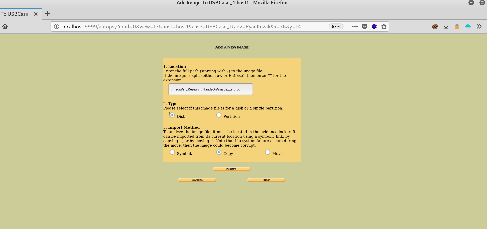
**Figure 4:** Adding an image.

Image details and hash calculation.
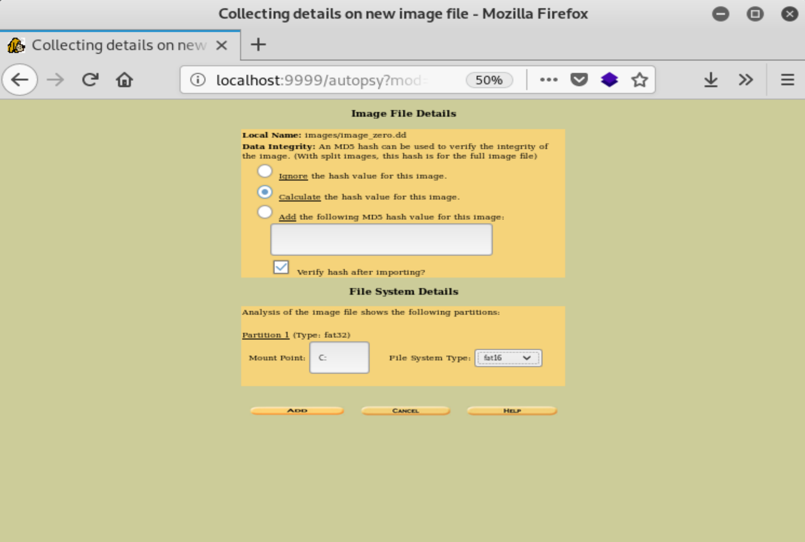
**Figure 5:** Image details.

After adding the image we then are ready to analyze the drive.
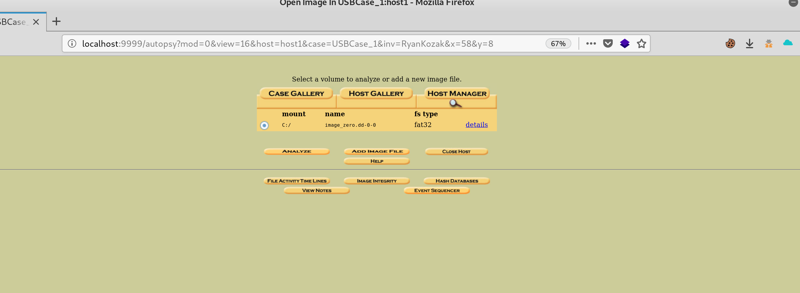
**Figure 6:** Image ready for analysis.

The rest of the screen shots of the analysis can be found in the questions answered below. This makes more sense to me than repeating screen shots and making this even longer than it has to be

### Task 3
1. How many files are there on the USB drive? What are they?  

    * There are two files that have not been deleted, `boring.jpg` and `where_were_you.mp3` (ignoring the system files such as the boot record.). See figure 7 below.  

    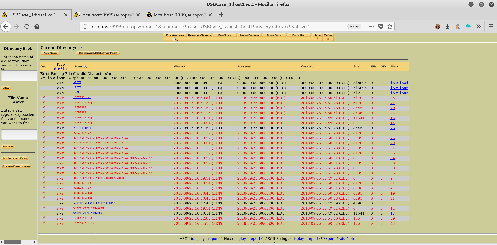
    **Figure 7:** Files on USB drive.

2. Which file/files are deleted?  

    * It appears as if there are around 23 deleted files. Some of these files are renamed versions of one another, probably temp files from the OS, see figure 8.  

    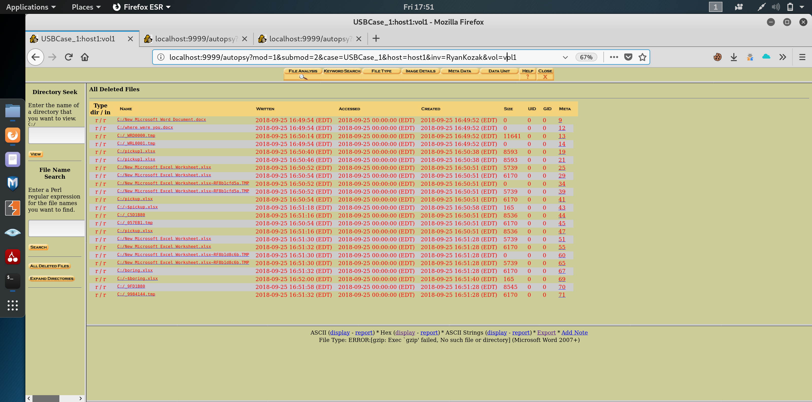
    **Figure 8:** Deleted files.

3. Can you open the `boring.jpg` file with an image viewer? Why? How did you open it
eventually?  

    * You cannot open `boring.jpg` with an image viewer because it is not an actual `.jpg` file. The file is a Microsoft Excel file. This can be determined a few ways. The way we were told to determine it was to look at the hex code to determine the magic number, which is `504b`. Autopsy also tells you in plain English that this is a Microsoft Excel 2007+ file. Both indications are visible in figure 9. The file can be opened simply by changing the file extension to `.xls` (see figure 10).

    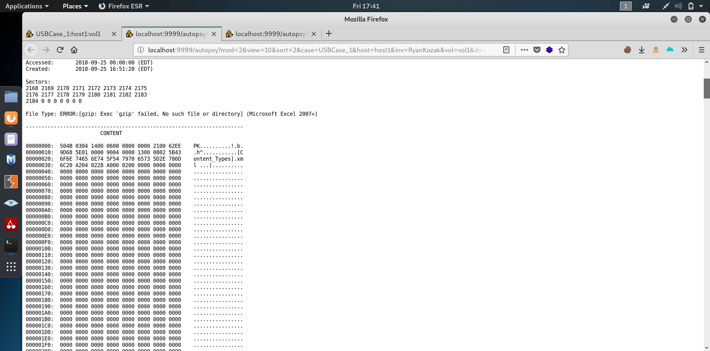
    **Figure 9:** Hexadecimal content of `boring.jpg`.

    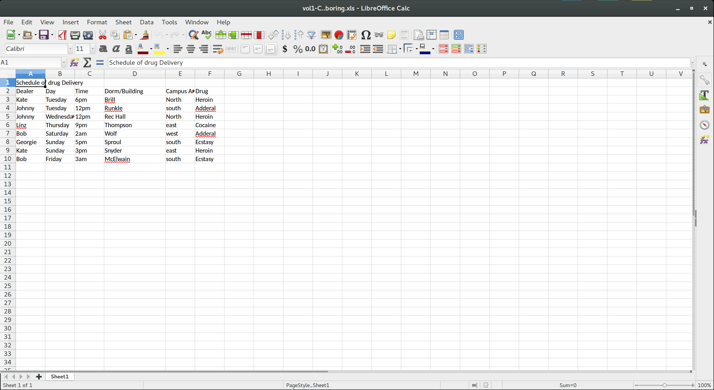
    **Figure 10:** Opened Excel file containing bad guys.

4. Were there any secret messages? If so, in which file are they located?   

    * There was a secret message (...secret) in the `where_were_you.mp3` file found on the drive. It was actually a Microsoft `.doc` file (see figure 11).

    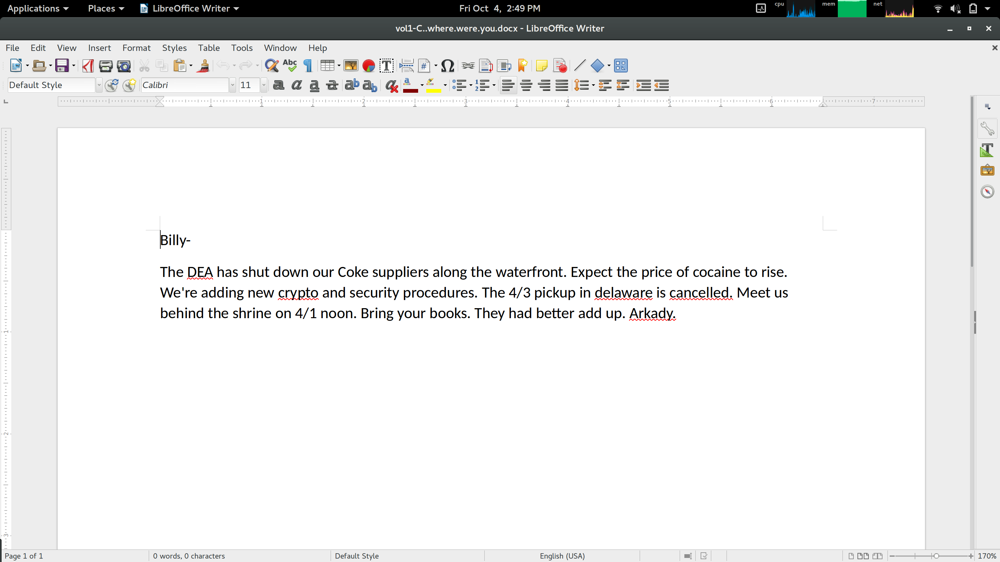
    **Figure 11:** Where were you message.

5. What is the name of Billy’s supplier?  

    * I'm not the police, but judging by the message found in figure 11 above it's **Arkady**.

6. When and where is the next meet?  

    * See figure 11 again, because it appears they're meeting "behind the shrine" on 4/1 at noon.

7. Who else on campus is involved? (Take a screenshot to prove the answer)  

    * We can determine the first names of the other individuals involved to be Kate, Johnny, Linz, and Bob. All the names listen in the `boring.jpg` Microsoft Excel sheet. See figure 12, a repeat of figure 10.

    
    **Figure 12:** The first names of those involved are in the dealers column.
