---
title: "CSC153: Activity 5: Use Winhex to Examine NTFS Disks"
author: Ryan Kozak
date: "2019-11-02"
subject: "CSC153 Activity 4"
keywords: [CSUS, CSC153, WinHex]
lang: "en"
titlepage: true
titlepage-text-color: "FFFFFF"
titlepage-color: "004E36"
titlepage-rule-color: "C4B581"
logo: "./images/csus.png"
logo-width: 150
...

# Objectives  
* Become familiar with the WinHex forensics tool.
* Use WinHex to become familiar with different file types.
* Use WinHex to explore and become familiar with the MFT, including headers and attributes.


## Part 1: Explore different file types

First we use Microsoft Word to create a new document named `Mywordnew.doc`, containing text `This is a test`. Then we open WinHex, navigate to the directory where our `.doc` file was saved, and open it. Lastly, we copy the file  hexadecimal header `D0 CF 11 E0 A1 B1 1A E1` to a new text document.  

Hexadecimal header for `.doc` file.  
```
Offset      0  1  2  3  4  5  6  7   8  9  A  B  C  D  E  F

00000000   D0 CF 11 E0 A1 B1 1A E1  00 00 00 00 00 00 00 00   �� ࡱ �  
```  

  
\ **Figure 1:** Header for Word 97-2003 Document `.doc`.  

These steps are repeated for the following file types, `.xls`, `.docx`, `.xlsx`, `.jpg`, and `.png`.   

Screenshots and text for each file type can be found listed below.


Hexadecimal header for `.xls` file type.
```
Offset      0  1  2  3  4  5  6  7   8  9  A  B  C  D  E  F

00000000   D0 CF 11 E0 A1 B1 1A E1  00 00 00 00 00 00 00 00   �� ࡱ �  
```  

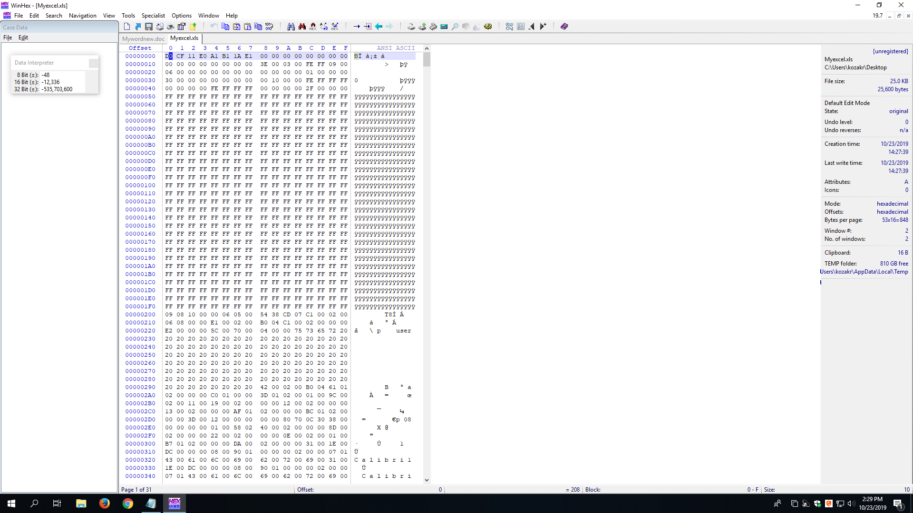  
\ **Figure 2:** Header for Excel 97-2003 Workbook `.xls`.  

Hexadecimal header for  `.docx` file type.
```
Offset      0  1  2  3  4  5  6  7   8  9  A  B  C  D  E  F

00000000   50 4B 03 04 14 00 06 00  08 00 00 00 21 00 DF A4   PK          ! ߤ
```  

  
\ **Figure 3:** Header for Word 2007 Document `.docx`.  

Hexadecimal header for  `.xlsx` file type.
```
Offset      0  1  2  3  4  5  6  7   8  9  A  B  C  D  E  F

00000000   50 4B 03 04 14 00 06 00  08 00 00 00 21 00 62 EE   PK          ! b�
```  

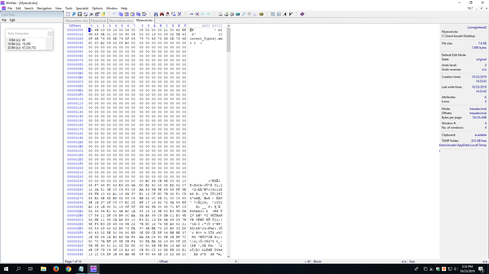  
\ **Figure 4:** Header for Excel 2007 Workbook `.xlsx`.  

Hexadecimal header for  `.jpg` file type.  
```
Offset      0  1  2  3  4  5  6  7   8  9  A  B  C  D  E  F

00000000   FF D8 FF E0 00 10 4A 46  49 46 00 01 01 01 00 60   ����  JFIF     `
```  

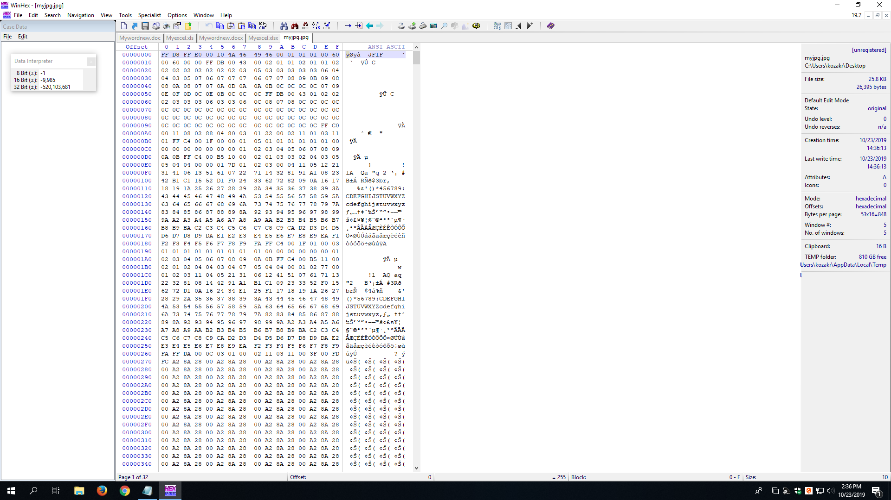  
\ **Figure 5:** Header for `.jpg`.


Hexadecimal header for `.png` file type.  
```  
Offset      0  1  2  3  4  5  6  7   8  9  A  B  C  D  E  F

00000000   89 50 4E 47 0D 0A 1A 0A  00 00 00 0D 49 48 44 52   �PNG        IHDR
```  

  
\ **Figure 6:** Header for `.png`.


**Observations:** As you can see, hexadecimal headers for `.doc` and `.xls` files match one another. Additionally, `.docx` and `.xlsx` also match one another. It seems the Microsoft Office Suite versions produce files with the same hex header, version 97-2003 match one another, and version 2007+ match one another. It doesn't appear that spreadsheet files differ from word documents, which is surprising. It's all about the version.  


## Part 2: Explore MFT.  
The second part of this activity requires we create a file named `lab1part2.txt`, containing the following,
```
A countryman between two layers is like a fish between two cats.  
A slip of the foot you may soon recover, but a slip of the tongue you may never get over.
An investment in knowledge always pays the best interest.
Drive thy business or it will drive there.
```

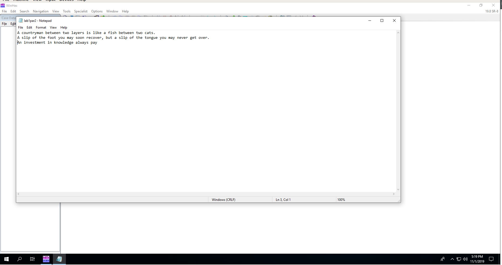  
\ **Figure 7:** Creating `lab1part2.txt` file.  

We then open WinHex as an administrator, and navigate `Options->Edit Mode` to select `Read-Only Mode`.  
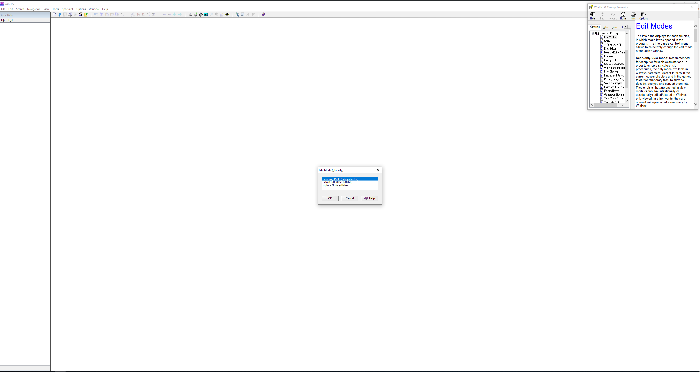  
\ **Figure 8:** Set WinHex to Read-Only Mode.  


After this we select a disk to open via `Tools->Open Disk`, and choose the `C:` drive. This is the drive on which we saved `lap1part2.txt`.  
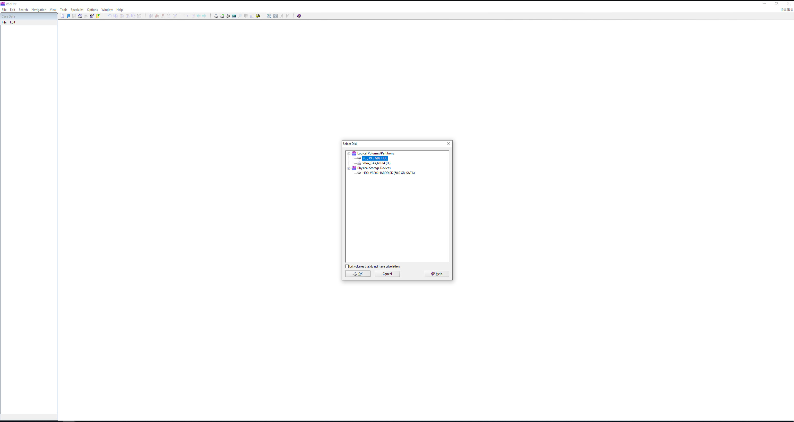  
\ **Figure 9:** Choosing the `C:` drive as our disk to open.  


The data interpreter must be set to `Win32 FILETIME (64 bit)`, via the `Options->Data Interpreter` section of the menu.  
  
\ **Figure 10:** Set Data Interpreter to `Win32 FILETIME (64 bit)`.


At this point we open up `lab1part2.txt`, and click at the beginning of the record.  
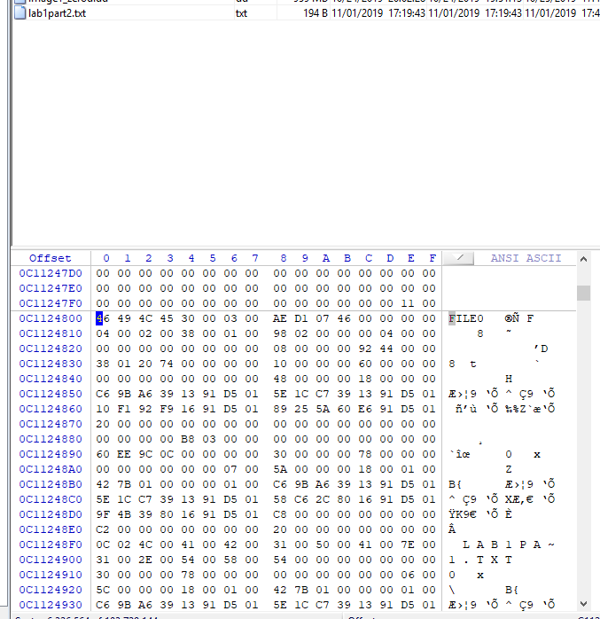  
\ **Figure 11:** Beginning of the record for `lab1part2.txt`.


In order to find the start of the `0x10` attribute, we click the beginning of the MFT record and drag until the offset counter is `0x38`.  
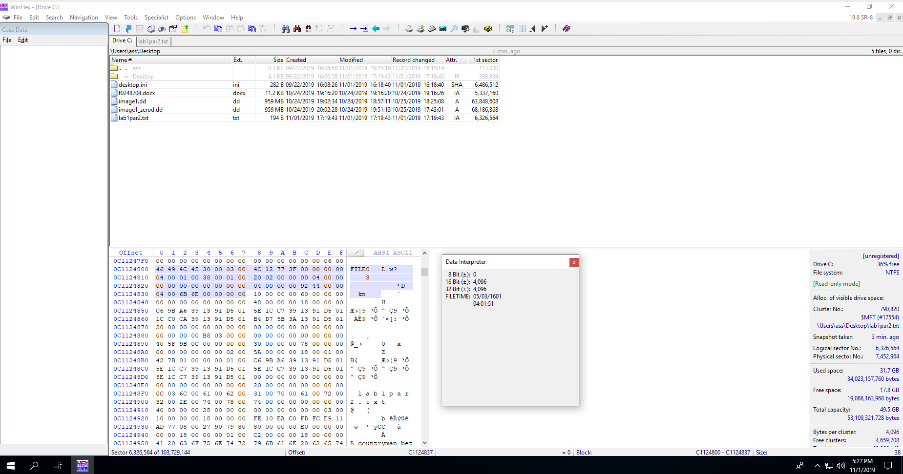  
\ **Figure 12:** The start of attribute `0x10` at offset `0x38`.  

The file's created date and time can be found at offset `0x10` to `0x1F` from the beginning of attribute `0x10`.  
  
\ **Figure 13:** File created date and time.

Now, we repeat the steps in Figure 13 to answer the questions found below.

### Questions  

1. According to the data interpreter, what is the file create date and time for the file `lab1part.txt`?  
    * The file created date and time is `11/02/2019 00:19:43` according to the data interpreter.  
      
    \ **Figure 14:** Data Interpreter's file created date and time.  

2. Using File Explorer and go to the folder where the `lab1part2.txt` located, right click on the arrow
near “Size” or “Name”, and select the “Date created”. Now the “Date created” time is also
displayed.
    * The File Explorer's file created date and time is `11/01/2019 at 5:19PM`.  
    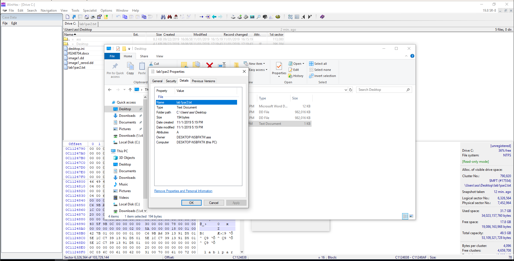  
    \ **Figure 15:** File Explorer's created date and time.

3. Compare this time and the time you got from data interpreter. Are they the same? If not, why?  
    * The time for the Data Interpreter is ahead of what the File Explorer says. When we go to `Options->Data Interpreter` and check the `Timestamps based on UTC` box, the dates actually do match. The reason they did not match previously is because the File Explorer was basing it off UTC, and the Data Interpreter was not. See below the screenshots on correcting this.   
    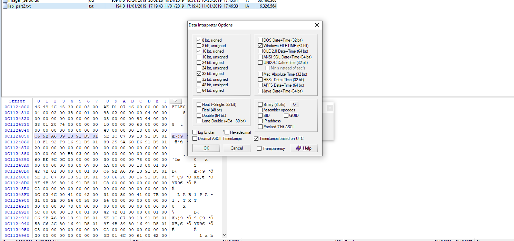  
    \ **Figure 16:** Selecting `Timestamps based on UTC` for Data Interpreter.  

    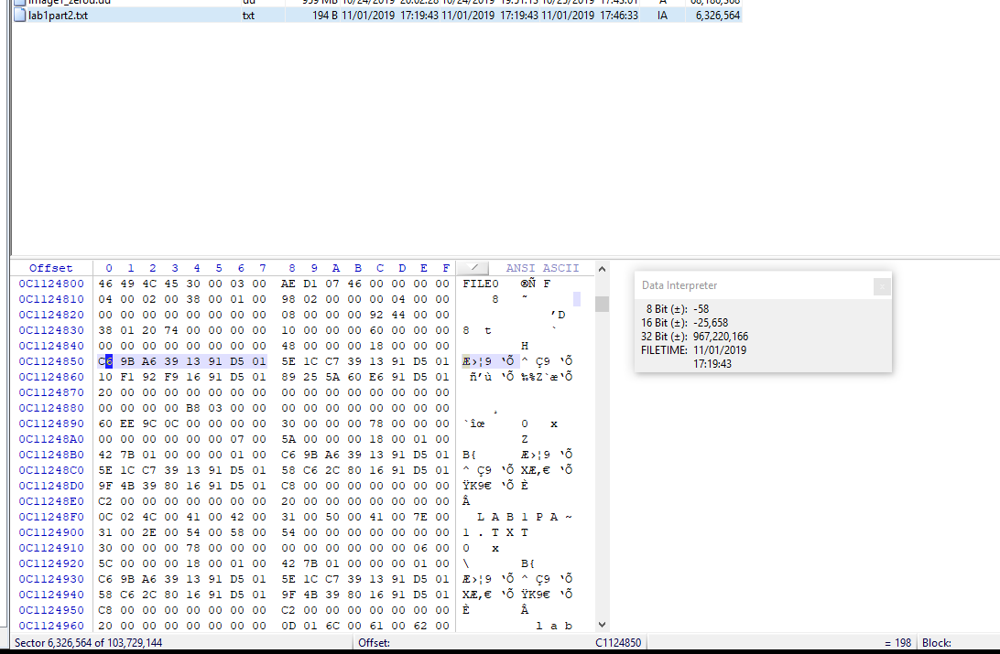  
    \ **Figure 17:** Now the file created date and times both match at 5:19PM November 1st 2019.  


4. What is the size of the MFT record?  
    * The size of the MTF record is, in big endian, is `00 00 04 00`. We can find that at offset `0x1C` to `0x1F` from `0x00`.  
    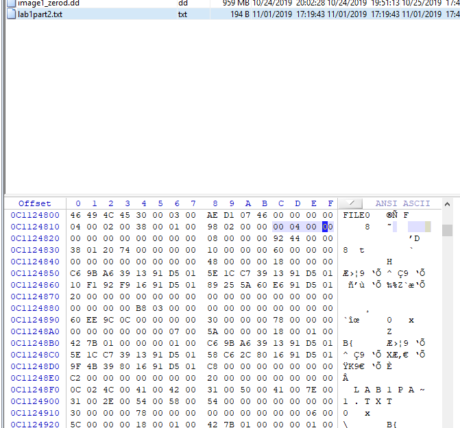  
    \ **Figure 18:** The size of the MFT record.  

5. What is the length of the header for the MFT record?  
    * The header length for the MFT record is `0x38`. This can be found at offset `0x14` from `0x00`.  
    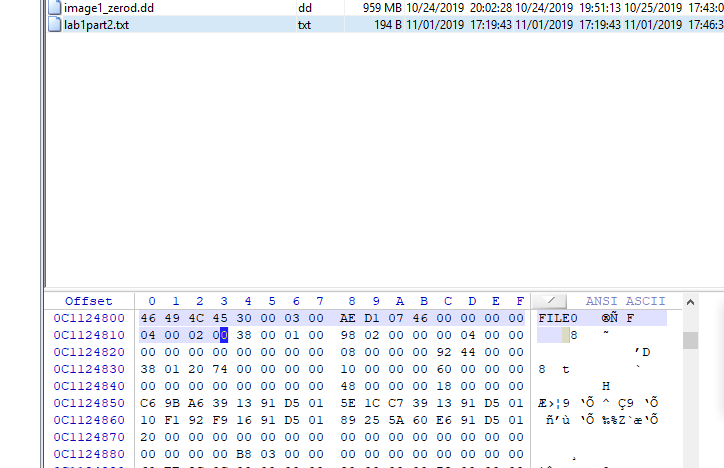  
    \ **Figure 19:** The length of the MFT record's header is `0x38`.


6. What is the file’s last modified date and time? Take a screenshot with data interpreter to prove
your answer.
    * The file's last modified date and time are `11/01/2019 17:19:43`. We can find that information at offset `0x20` to `0x27` from `0x10`. It should be noted that this is with the box for `Timestamps based on UTC` selected.  
    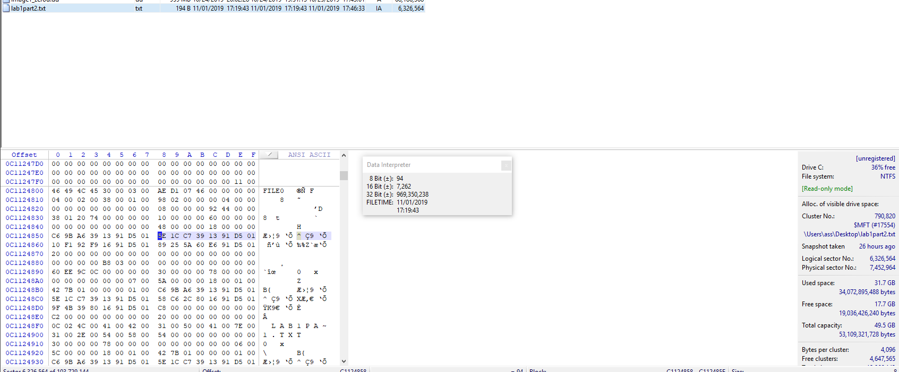  
    \ **Figure 20:** File last modified date, based on UTC.  


7. What is the file name? In which attribute and at what position can you find it?  
    * As we've learned from lecture 5's handout, if the file name is longer than eight characters there are two attributes `0x30`. Since our file name is longer than 8 characters we fall into this case. That means we have a short file name, and a long file name.
    * Short file names are found at offset `0x5A` from the first `0x30` attribute. Our short file name is `LAB1PA~1.TXT`.  
    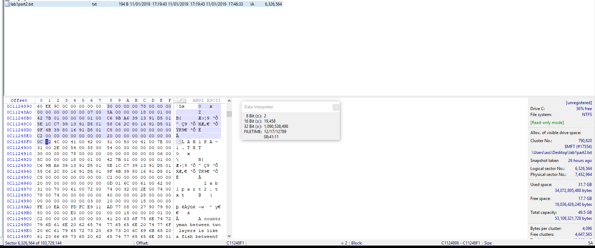  
    \ **Figure 21:** The short file name at `0x5A` from the first `0x30` attribute.  
    * Long file names are found at offset `0x5A` from the second `0x30` attribute. Our short file name is `lab1part2.txt`.  
    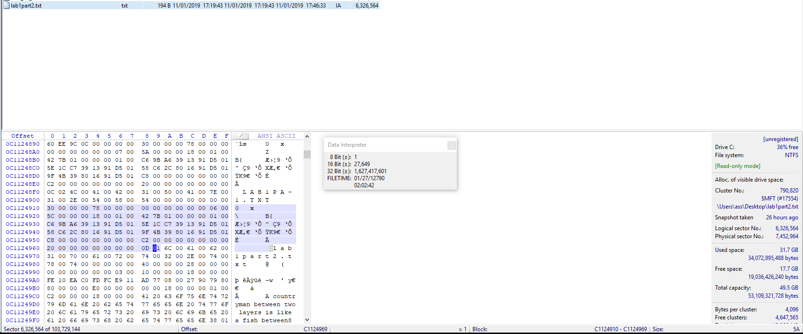  
    \ **Figure 22:** Long file name at offset `0x5A` from the second `0x30` attribute.  


8. Is this file a resident file or nonresident file? Where can you find the evidence?  
    * The resident/nonresident flag exists at offset `0x08` from attribute `0x80`.  In this case we can see it is a resident file. This makes sense because it is only 194 Bytes in size.  
    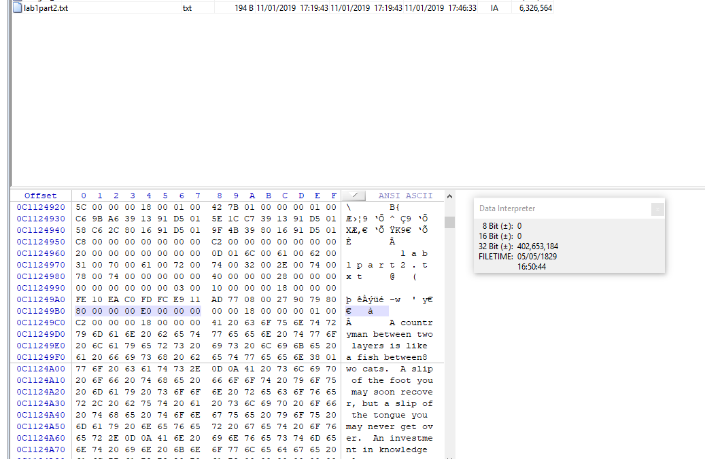  
    \ **Figure 23:** Resident flag set to `0x00`, meaning it is a resident file.

9. In which attribute can you find the data run? Where is the start of the data run?  
    * The start of the data run for resident files exists at offset `0x18` from attribute `0x80`.
    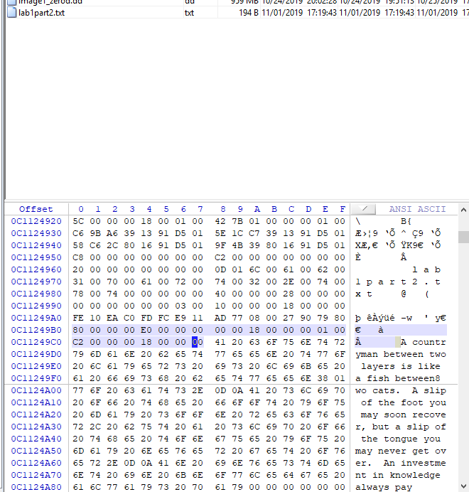  
    \ **Figure 24:** The start of the data run at offset `0x18` from attribute `0x80`.
