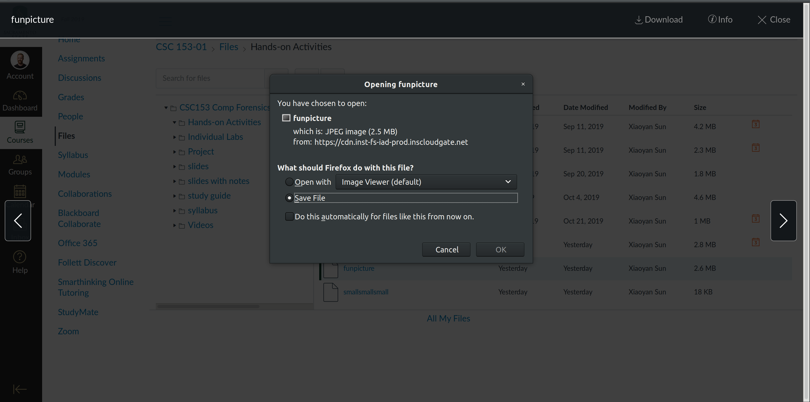
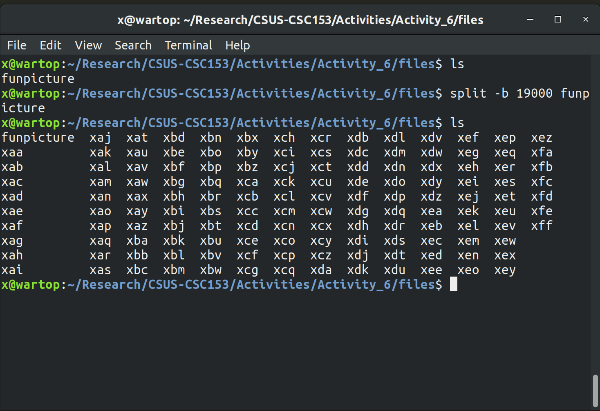
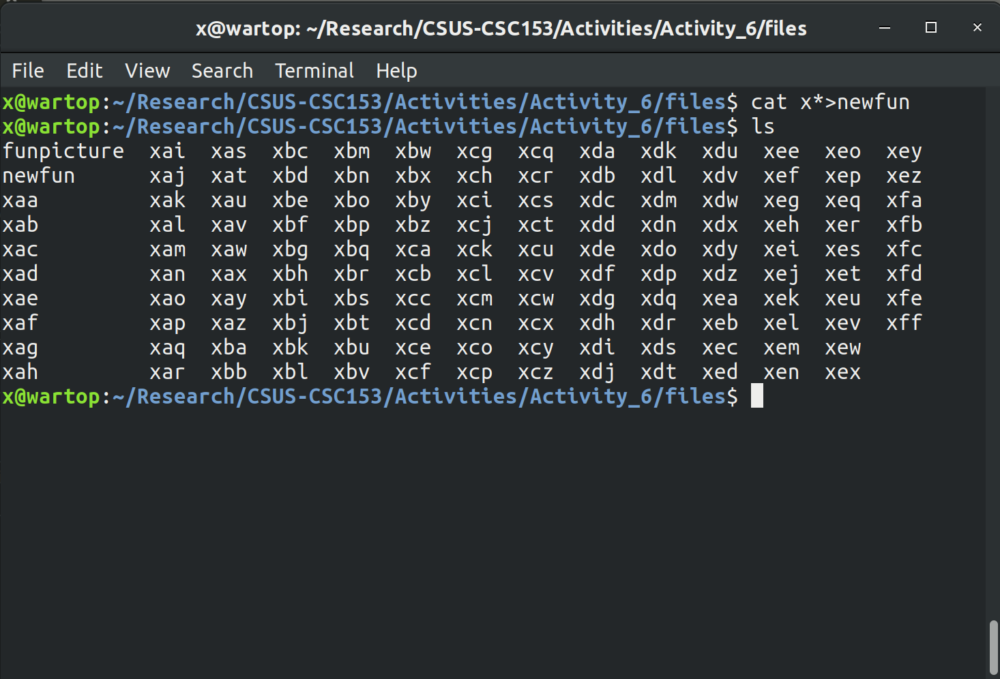
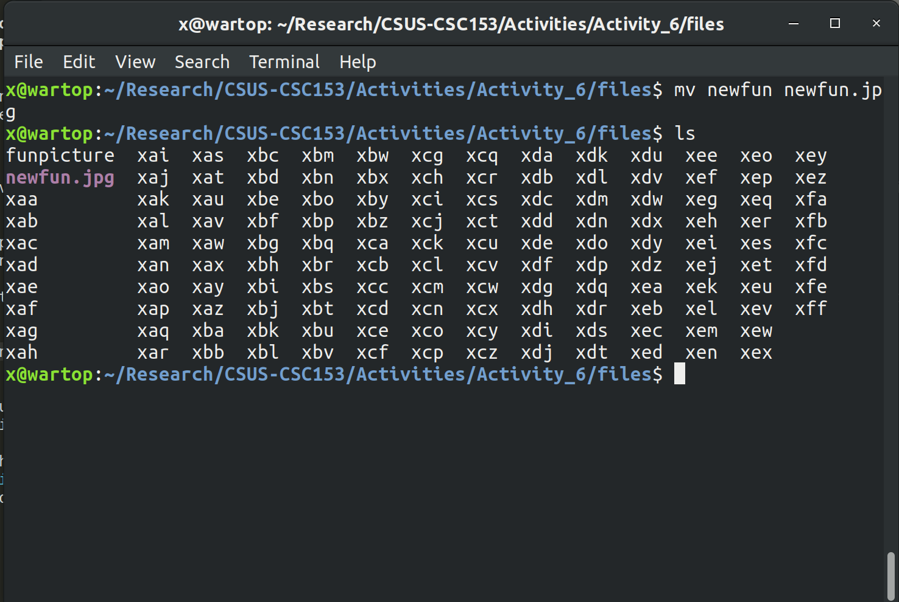

# Activity 6: Recovering Graphics Files  
### CSC 153 - Computer Forensics Principles and Practice  

## Objectives  
* Split and combine files in Linux.
* Use WinHex to recover graphics files.


### Part 1: Split and combine files in Linux.
Since evaluation version of Winhex cannot process files larger than 200KBs, we must the file into pieces in order to edit it.  

The first step is to download the file `funpicture` from Canvas onto our local Linux machine.  
  
**Figure 1:** Downloading `funpicture` to our local machine.

We then open the terminal and navigate to the directory that cointains this file, and  split the file via the split command.  

```
split –b 19000 funpicture
```  

  
**Figure 2:** Splitting `funpicture` file, and listing results.  

After splitting the file we recombine it with the command `cat x*>newfun`.  
  
**Figure 3:** Recombining the image with the `cat` command.  

The last step for part 1 is to rename the combined file to include the `.jpg` extension, via `mv newfile newfile.jpg`.  
  
**Figure 4:** Rename `newfile` to `newfile.jpg`.  

### Part 2: Practice recovering graphics files using Winhex.