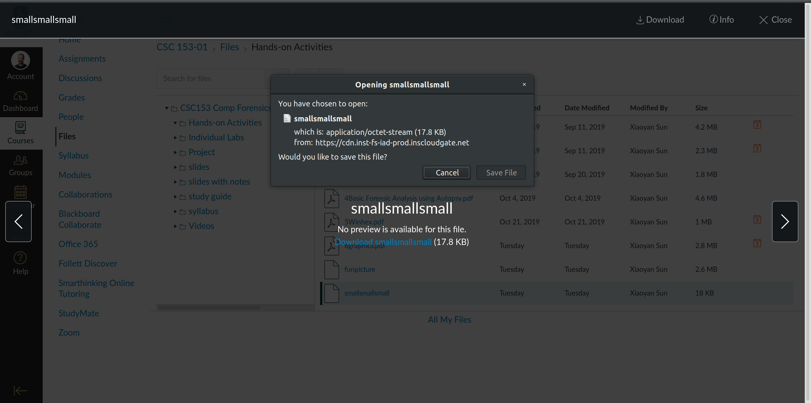

# Activity 6: Recovering Graphics Files  
### CSC 153 - Computer Forensics Principles and Practice  

## Objectives  
* Split and combine files in Linux.
* Use WinHex to recover graphics files.

### Part 1: Split and combine files in Linux.  
Since evaluation version of Winhex cannot process files larger than 200KBs, we must split the file into pieces in order to edit it.    

The first step is to download the file `funpicture` from Canvas onto our local Linux machine.    
    
**Figure 1:** Downloading `funpicture` to our local machine.  

We then open the terminal and navigate to the directory that cointains this file.    
  
**Figure 2:** Change directory to where we've downloaded `funpicture`.  

 Now we must split the file via the split command `split –b 19000 funpicture`.  
  
**Figure 3:** Splitting `funpicture` file, and listing results.  

After splitting the file we recombine it with the command `cat x*>newfun`.    
  
**Figure 4:** Recombining the image with the `cat` command.  

The last step for part 1 is to rename the combined file to include the `.jpg` extension, via `mv newfile newfile.jpg`.  
  
**Figure 5:** Rename `newfile` to `newfile.jpg`.  

  
### Part 2: Practice recovering graphics files using Winhex.  

Now we download the file `smallsmallsmall` from Canvas and save it to our working directory folder. This file is a `PNG` file, but the
header has been modified by the suspect.  
  
**Figure 6:** Downloading `smallsmallsmall` to our local machine, in a shared folder with our the Windows VM.  

Now we boot our Windows VM and start WinHex with the Run as administrator option.  
  
**Figure 7:** Launching WinHex as Admin. 

As a safety precaution, click Options, Edit Mode from the menu. In the Select Mode dialog box, click Read-Only Mode (=write protected), as shown in Figure 2, and then click OK.