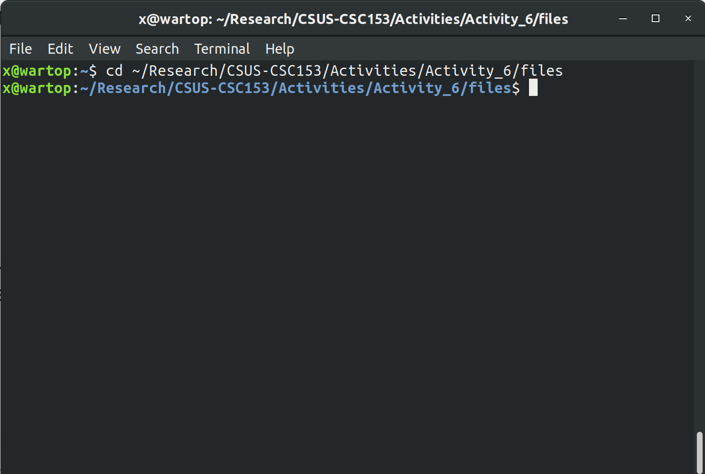

# Activity 6: Recovering Graphics Files  
### CSC 153 - Computer Forensics Principles and Practice  

## Objectives  
* Split and combine files in Linux.
* Use WinHex to recover graphics files.

### Part 1: Split and combine files in Linux.  
Since evaluation version of Winhex cannot process files larger than 200KBs, we must split the file into pieces in order to edit it.    

The first step is to download the file `funpicture` from Canvas onto our local Linux machine.    
    
**Figure 1:** Downloading `funpicture` to our local machine.  

We then open the terminal and navigate to the directory that cointains this file.    
  
**Figure 2:** Change directory to where we've downloaded `funpicture`.  

 Now we must split the file via the split command `split –b 19000 funpicture`.  
  
**Figure 3:** Splitting `funpicture` file, and listing results.  

After splitting the file we recombine it with the command `cat x*>newfun`.    
  
**Figure 4:** Recombining the image with the `cat` command.  

The last step for part 1 is to rename the combined file to include the `.jpg` extension, via `mv newfile newfile.jpg`.  
  
**Figure 5:** Rename `newfile` to `newfile.jpg`.  

  
### Part 2: Practice recovering graphics files using Winhex.  

Now we download the file `smallsmallsmall` from Canvas and save it to our working directory folder. This file is a `PNG` file, but the
header has been modified by the suspect.  
  
**Figure 6:** Downloading `smallsmallsmall` to our local machine, in a shared folder with our the Windows VM.  

Now we boot our Windows VM and start WinHex with the Run as administrator option.  
  
**Figure 7:** Launching WinHex as Admin. 

As a safety precaution, we click `Options -> Edit Mode` from the menu. In the Select Mode dialog box,  we click `Read-Only Mode (=write protected)`, as shown in Figure 8, and then click OK.  
    
**Figure 8:** Select read-only mode for safety.  

Next we click `Tools -> Open Disk` from the menu. In the View Disk dialog box, we click the drive where we saved `smallsmallsmall`. In our case we've moved the file to the `Desktop`, so we'll select the `C:` drive.  
  
**Figure 9:** Selecting the `C:` drive to open and examine.  

After we click `Ok` WinHex beings traversing the `C:` drive.  
  
**Figure 10:** WinHex traversing our `C:` drive.  

Now we scroll down and find the `$MFT` file, right click and choose open. We open the MFT file in a new window as seen in the figure 11 below.
  
**Figure 11:** Opening `$MFT` to seach for our file. 

The next task is to find the `smallsmallsmall` file. In the `$MFT`, characters in a file name are usually separated by hexadecimal value `00`. The hexadecimal value for the word *small* is `73 6d 61 6c 6c`. Separating each character with `00` it becomes `73 00 6d 00 61 00 6c 00 6c`. Repeating this three times to get *smallsmallsmall* becomes `73006D0061006C006C0073006D0061006C006C0073006D0061006C006C00`.  

We click `Search -> Find Hex Values`, and query the hexidecimal string we calculated above.  
  
**Figure 12:** Searching for the hexidecimal title of `smallsmallsmall`.  

After our search we can see that there is a hit.  
  
**Figure 13:** A it for the hexidecimal search.  

Following the same methodology as we did in hands-on activity 5 , we examine the `$MFT` file record. We can find the start of the data run for this file by looking at offset `0x40` from attribute `0x80`.  
  
**Figure 14:** First data run info is `31 05 90 4B 11 00`.  

The first data run is `31 05 90 4B 11 00`, which means the starting position for the first data run is `0x 00 11 4B 90` and the size is `0x05`. So next, we open the window for the `C:` drive once again, and click on `Navigation -> Go To Offset`. We'll go to the offset we've just found, appending three zeros to the end of it (see Figure 15 below).  

  
**Figure 15:** The first data run at offset `114B90000`.  

Now we're taken to the beginning of the `smallsmallsmall` file.  
  
**Figure 16:** Beginning of `smallsmallsmall` file.  

Since the size of the first data run is `0x05`, we can click on `Navigation -> Go To Offset` again to find the end of the first data run. Setting `05000` as our position and choosing current position will take us to the ending point for the first data run.  

  
**Figure 17:** Go To Offset at the end of first data run.  

In our case the end of the first data run is at offset  `0x114B95000`.  
  
**Figure 18:** End of the first data run at.  

Starting from the beginning of the file again, we click on the first byte of the file and drag it until the offset is `5000`, which is the size of the data run.  
  
**Figure 19:** Selecting everything from first data run.  

Next we right click and choose `Edit -> Copy Block -> Into New File`.  
  
**Figure 20:** Copy block to new file.

  
**Figure 21:** New file from data run copied in figure 20.

The correct header for the PNG file format is `89 50 4E 47`, so we change the header of the new file from `33 33 33 33` to `89 50 4E 47`, and save it as *recovered*.

  
**Figure 22:** Replace file header with proper header for PNG.  

  
**Figure 23:** Saving file as *recovered*.  

Now once we add the `.png` extension, we can open the file `recovered.png` and see that it's a `58x75` pixel version of the image from Part 1.  
  
**Figure 24:** Opening recovered file.

### Questions  

1. What were the hexadecimal values did you used to search for the file `smallsmallsmall` in steps 13 and 15?
    * The hexadecimal value searched for was `73006D0061006C006C0073006D0061006C006C0073006D0061006C006C00`.
      
    **Figure 25:** Searching for the hexadecimal title of `smallsmallsmall`. 

2. Is the file a resident file or non-resident file? How do you know?  
    * This is a **non-resident** file, we can tell by looking at offset `0x08` from attribute `0x80` and see the flag is set to `0x01`. 
    
    **Figure 26:** Non-resident flag. 

3. How many data runs does this file has?
	* In my case this file had only **one data run**.  
	  
	**Figure 27:** One data run for this file.

4. What is the starting position for the first data run?  
    * The starting position for the first data run is at offset `0x00114B90`.  
	   
	 **Figure 28:** Starting position for first data run.

5. What is the size of the first data run?  
    * The size of the first data run is `0x05`.  
	   
	 **Figure 29:** Size of first data run is `0x05`.

6. In step 20, what is the header of the file `smallsmallsmall` which you downloaded from Canvas? Please provide the first 4 bytes of the hexadecimal values. 
	*  The header of the file downloaded from Canvas was `33 33 33 33`.
	
	**Figure 30:** The header of the `smallsmallsmall` file downloaded from Canvas.

