# Activity 7: Data Hiding and Steganography 
### CSC 153 - Computer Forensics Principles and Practice  

## Objectives  
* Practice data hiding techniques.
* Use S-Tools to do image Steganography.
* Use Winhex to hide data.

### Part 1: Software installation
First we download [**S-Tools4**](https://packetstormsecurity.com/files/21688/s-tools4.zip.html) and install it on our workstation. 
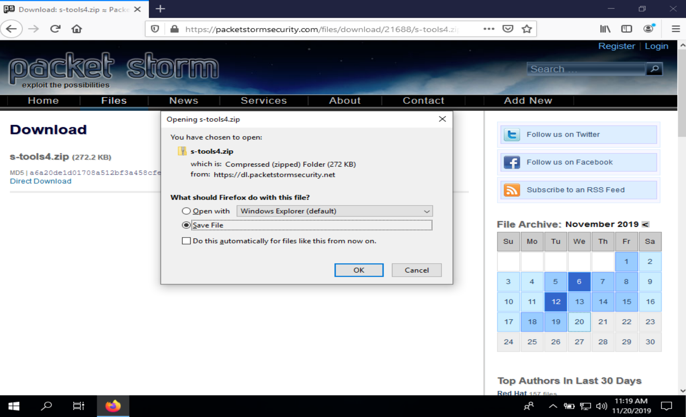  
**Figure 1:** Downloading S-Tools4. 

### Part 2: Create a steganography file using S-Tools  
In File Explorer, we navigate to the directory where we've installed [**S-Tools4**](https://packetstormsecurity.com/files/21688/s-tools4.zip.html) and start the program `S-
Tools.exe`.  
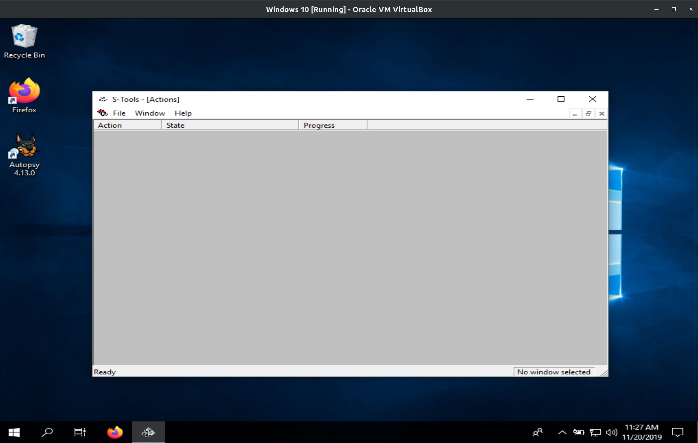  
**Figure 2:** `S-Tools.exe` opened.  

Next we download `fun.bmp` from Canvas or google drive and save it in our work directory.
The google drive link is: [https://drive.google.com/file/d/1LL1pzZQ10Tz0RZUmL1js7Kp6Ux-n4LJ4/view?usp=sharing](https://drive.google.com/file/d/1LL1pzZQ10Tz0RZUmL1js7Kp6Ux-n4LJ4/view?usp=sharing).  
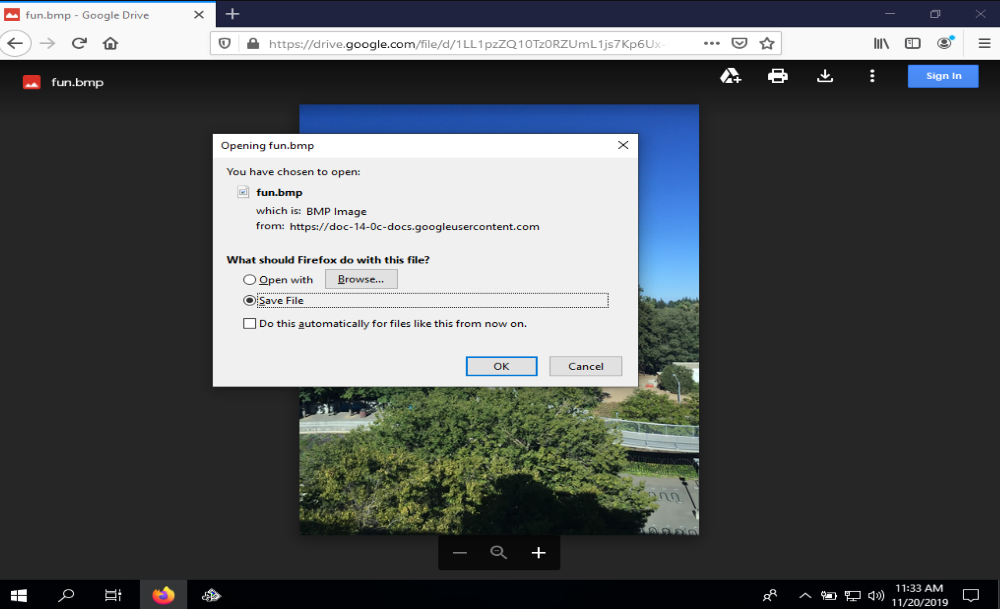  
**Figure 3:** Downloading `fun.bmp` from Google Drive.  

We then drag `fun.bmp` from our work folder to the S-Tools window.  
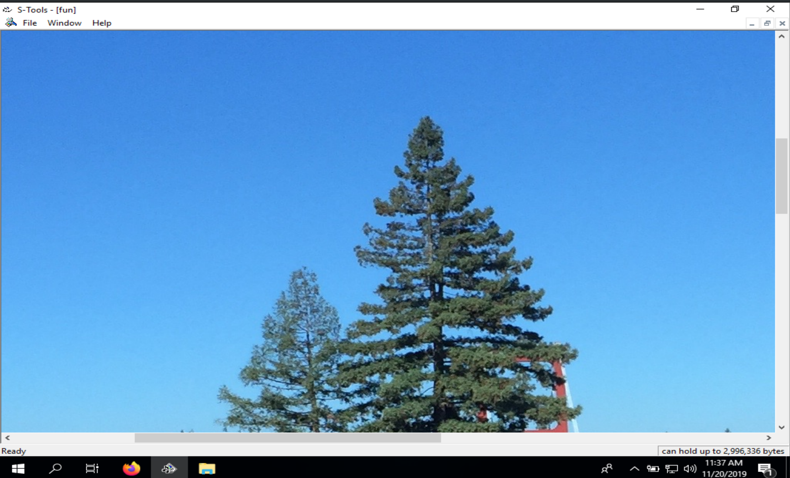  
**Figure 4:** After dragging `fun.bmp` into S-Tools.  

To hide information in our image file, we first must create a text file `secret_message.txt` and type our secret message into the file.  
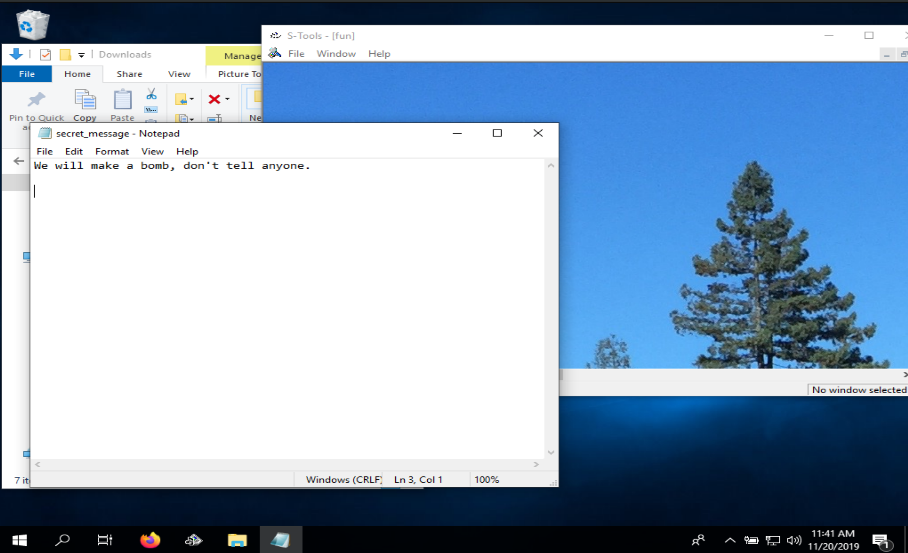  
**Figure 5:** Creating our secret message.  

After that we drag `secret_message.txt` from our work folder to the `fun.bmp` image. In the Hiding dialog box, we type `secret` in the Passphrase and Verify passphrase text boxes, and
then click `OK`.  
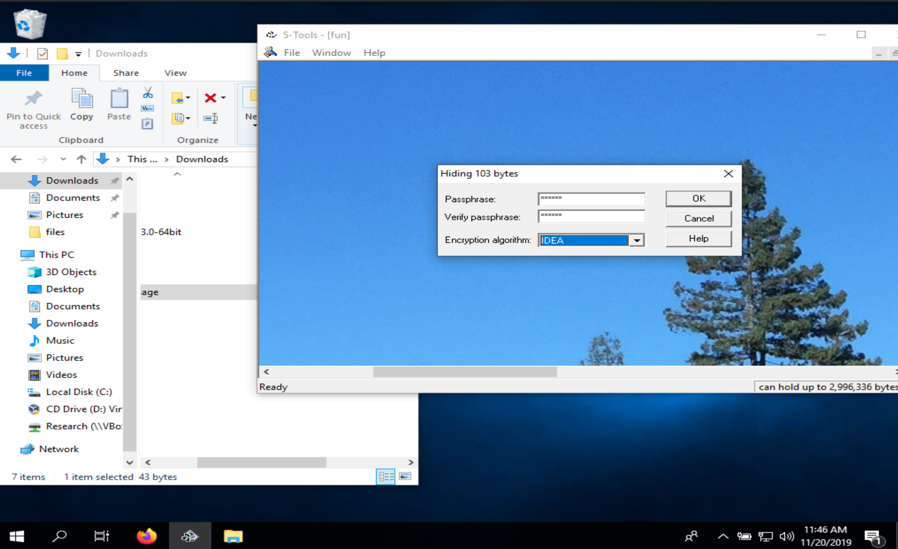  
**Figure 6:** Hiding secret message inside image.  

  
After the hidden data window opens, we right click the window and click Save as. We'll save the image as `fun-steg.bmp` in your work folder.  
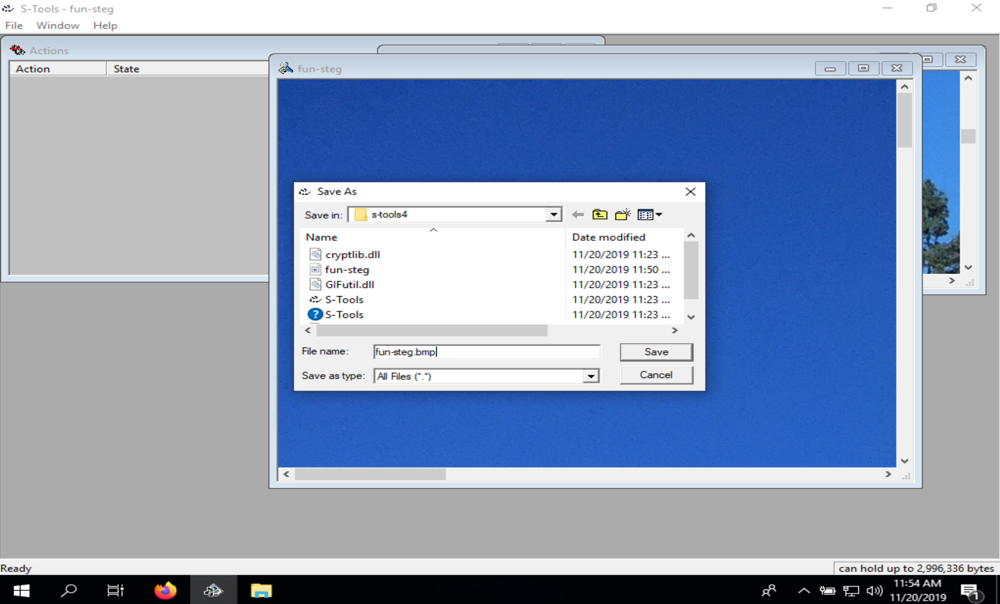  
**Figure 7:** Saving `fun-steg.bmp`.  

### Part 3: Create a steganography file using S-Tools and compare the difference using DOS command  
We're going to repeat what we did in Part 2 by starting `S-Tools.exe`, and this time downloading `scene.bmp` from Canvas or google drive and saving it in our work directory. The google drive link is:
[https://drive.google.com/file/d/1hmIYsXdV2SvG2VJYyfQfPCaW14ZBgaGx/view?usp=sharing](https://drive.google.com/file/d/1hmIYsXdV2SvG2VJYyfQfPCaW14ZBgaGx/view?usp=sharing).  
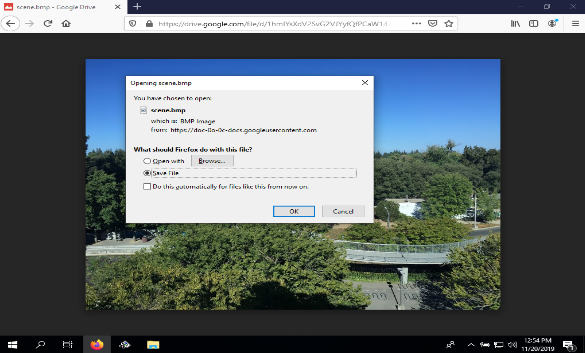  
**Figure 8:** Downloading `scene.bmp`.  

Now we'll drag `scene.bmp` from our work folder to the S-Tools window.  
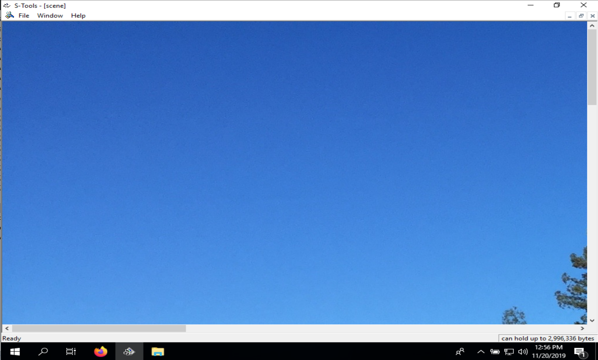  
**Figure 9:** After dragging `scene.bmp` into S-Tools.  

This time we'll create an `.rtf` file `hidden.rtf` and type our secret message into the file.  
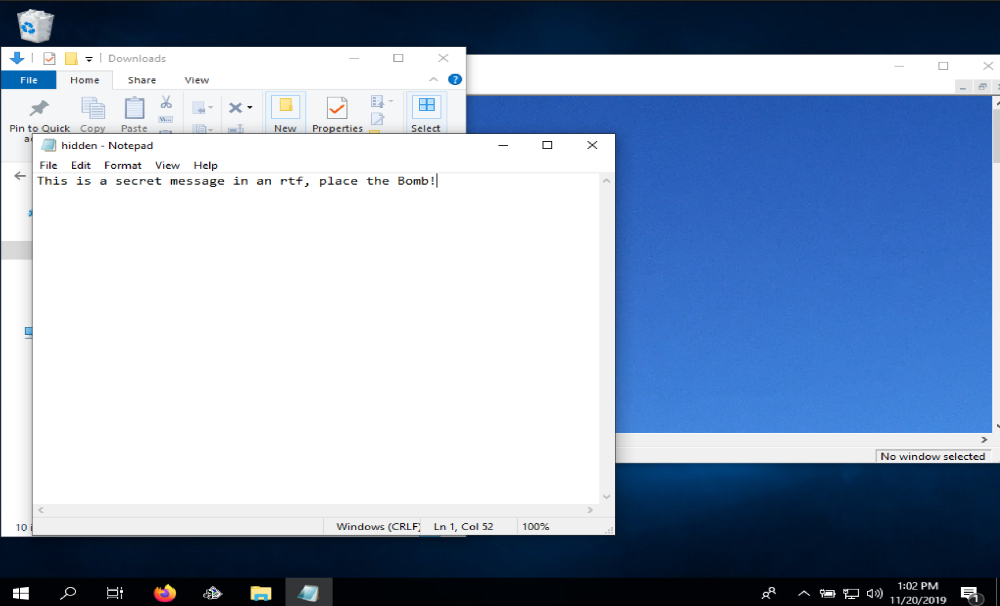  
**Figure 10:** Creating `hidden.rtf`.  

Next we drag the `hidden.rtf` file from our working folder to the `scene.bmp` image, and in the Hiding dialog box, type `secret` in the Passphrase and Verify passphrase text boxes, and then click `OK`.  
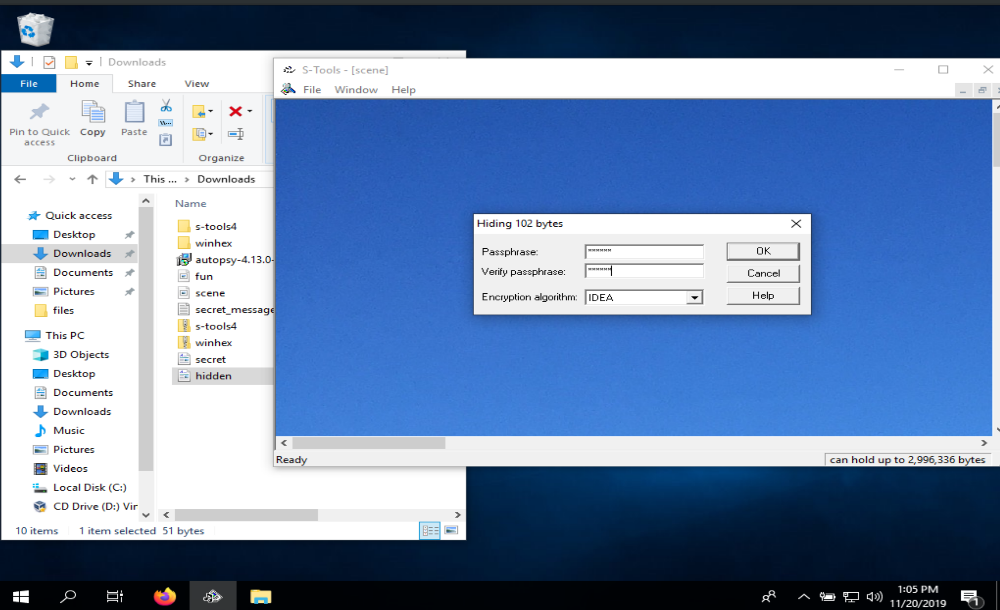  
**Figure 11:** Hiding `hidden.rtf` inside of `scene.bmp`.  

After the hidden data window opens, we right click the window and click Save as. We will save the image as `scene-steg.bmp` in our work folder.  
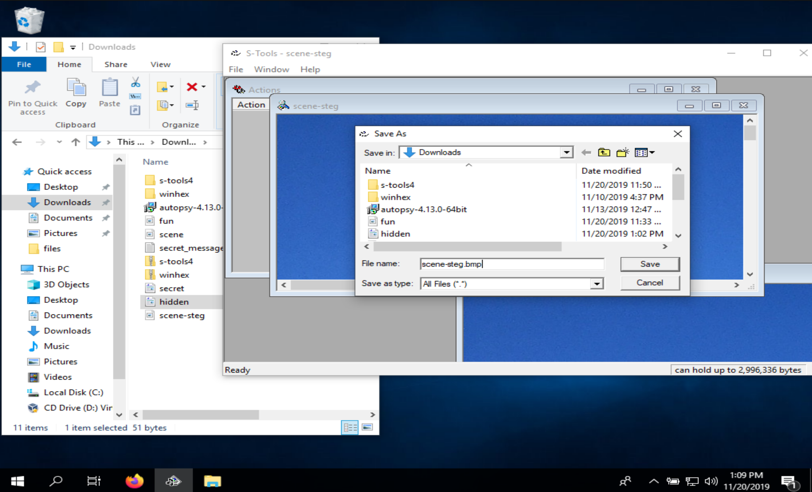  
**Figure 12:** Saving `scene-steg.bmp`.  

The next phase is to analyze the files in the command line using the command `comp scene.bmp scene-steg.bmp > scene-compare.txt`.  
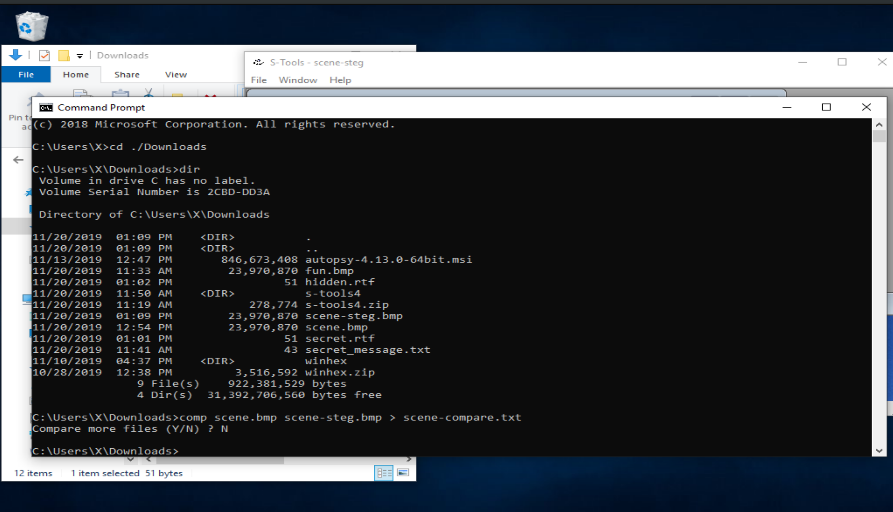  
**Figure 13:** Comparing files via the Windows command prompt.  

We can see by opening `scene-compare.txt` the discrepancies between the two files.  
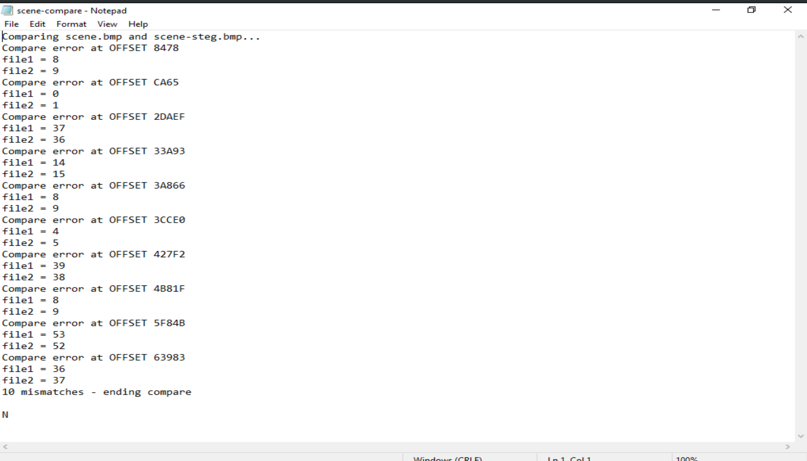  
**Figure 14:** Discrepancies between `scene.bmp` and `scene-steg.bmp`.    
