# Activity 7: Data Hiding and Steganography 
### CSC 153 - Computer Forensics Principles and Practice  

## Objectives  
* Practice data hiding techniques.
* Use S-Tools to do image Steganography.
* Use Winhex to hide data.

## Part 1: Software installation
First we download [**S-Tools4**](https://packetstormsecurity.com/files/21688/s-tools4.zip.html) and install it on our workstation. 
  
**Figure 1:** Downloading S-Tools4. 

## Part 2: Create a steganography file using S-Tools  
In File Explorer, we navigate to the directory where we've installed [**S-Tools4**](https://packetstormsecurity.com/files/21688/s-tools4.zip.html) and start the program `S-
Tools.exe`.  
  
**Figure 2:** `S-Tools.exe` opened.  

Next we download `fun.bmp` from Canvas or google drive and save it in our work directory.
The google drive link is: [https://drive.google.com/file/d/1LL1pzZQ10Tz0RZUmL1js7Kp6Ux-n4LJ4/view?usp=sharing](https://drive.google.com/file/d/1LL1pzZQ10Tz0RZUmL1js7Kp6Ux-n4LJ4/view?usp=sharing).  
  
**Figure 3:** Downloading `fun.bmp` from Google Drive.  

We then drag `fun.bmp` from our work folder to the S-Tools window.  
  
**Figure 4:** After dragging `fun.bmp` into S-Tools.  

To hide information in our image file, we first must create a text file `secret_message.txt` and type our secret message into the file.  
  
**Figure 5:** Creating our secret message.  

After that we drag `secret_message.txt` from our work folder to the `fun.bmp` image. In the Hiding dialog box, we type `secret` in the Passphrase and Verify passphrase text boxes, and
then click `OK`.  
  
**Figure 6:** Hiding secret message inside image.  

  
After the hidden data window opens, we right click the window and click Save as. We'll save the image as `fun-steg.bmp` in your work folder.  
  
**Figure 7:** Saving `fun-steg.bmp`.  

## Part 3: Create a steganography file using S-Tools and compare the difference using DOS command  
We're going to repeat what we did in Part 2 by starting `S-Tools.exe`, and this time downloading `scene.bmp` from Canvas or google drive and saving it in our work directory. The google drive link is:
[https://drive.google.com/file/d/1hmIYsXdV2SvG2VJYyfQfPCaW14ZBgaGx/view?usp=sharing](https://drive.google.com/file/d/1hmIYsXdV2SvG2VJYyfQfPCaW14ZBgaGx/view?usp=sharing).  
  
**Figure 8:** Downloading `scene.bmp`.  

Now we'll drag `scene.bmp` from our work folder to the S-Tools window.  
  
**Figure 9:** After dragging `scene.bmp` into S-Tools.  

This time we'll create an `.rtf` file `hidden.rtf` and type our secret message into the file.  
  
**Figure 10:** Creating `hidden.rtf`.  

Next we drag the `hidden.rtf` file from our working folder to the `scene.bmp` image, and in the Hiding dialog box, type `secret` in the Passphrase and Verify passphrase text boxes, and then click `OK`.  
  
**Figure 11:** Hiding `hidden.rtf` inside of `scene.bmp`.  

After the hidden data window opens, we right click the window and click Save as. We will save the image as `scene-steg.bmp` in our work folder.  
  
**Figure 12:** Saving `scene-steg.bmp`.  

The next phase is to analyze the files in the command line using the command `comp scene.bmp scene-steg.bmp > scene-compare.txt`.  
  
**Figure 13:** Comparing files via the Windows command prompt.  

We can see by opening `scene-compare.txt` the discrepancies between the two files.  
  
**Figure 14:** Discrepancies between `scene.bmp` and `scene-steg.bmp`.  

## Part 4: Extract the hidden messages/files  
Opening up S-Tools again, we'll extract the hidden message from `scene-steg.bmp` by dragging it into the S-Tools Window.  
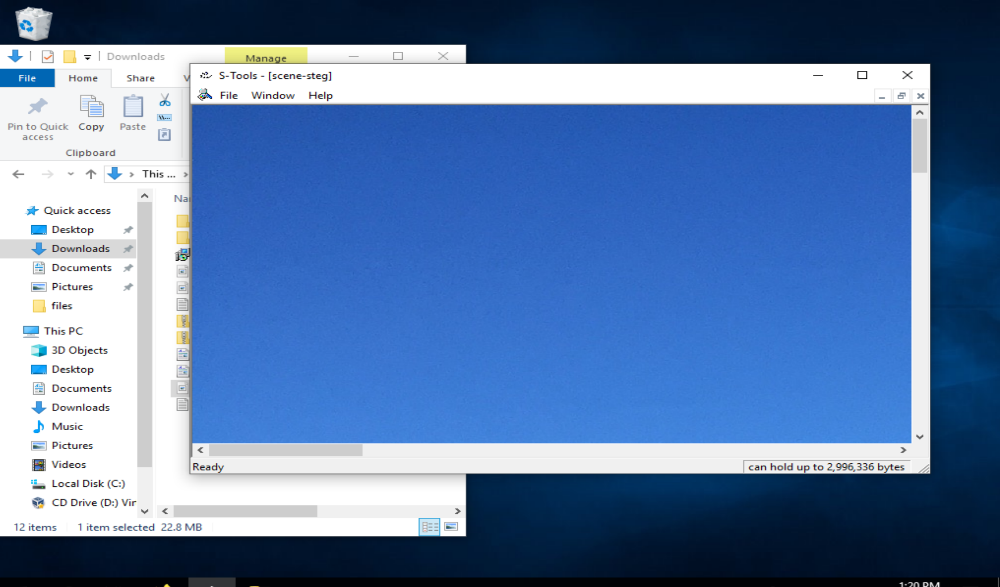  
**Figure 15:** Opening `scene-steg.bmp` once again in S-Tools.  

Right clicking on the image and choosing `Reveal` will prompt us for the pass phrase.  
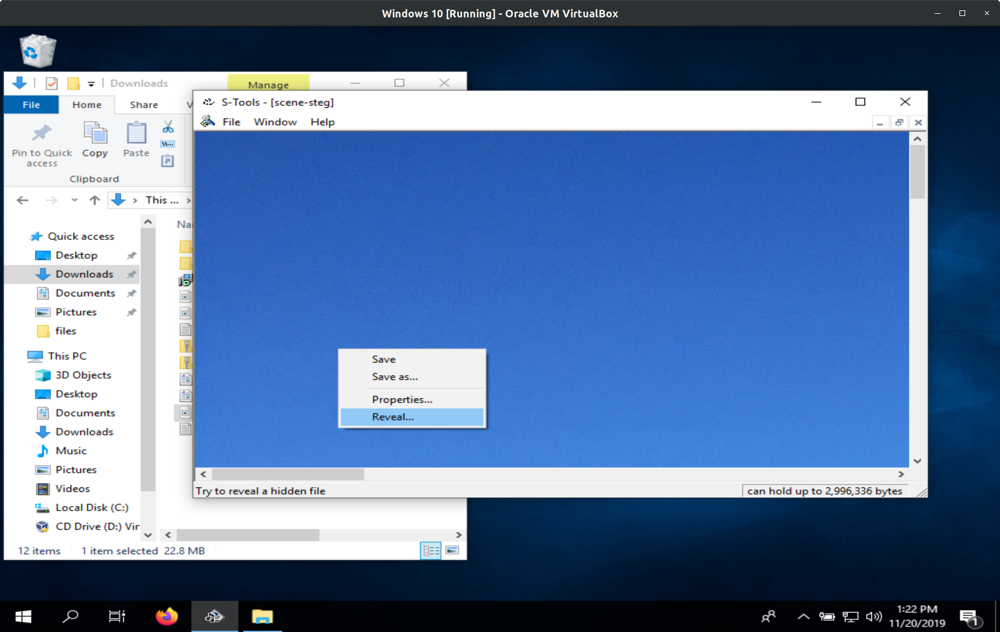  
**Figure 16:** Choosing Reveal.  

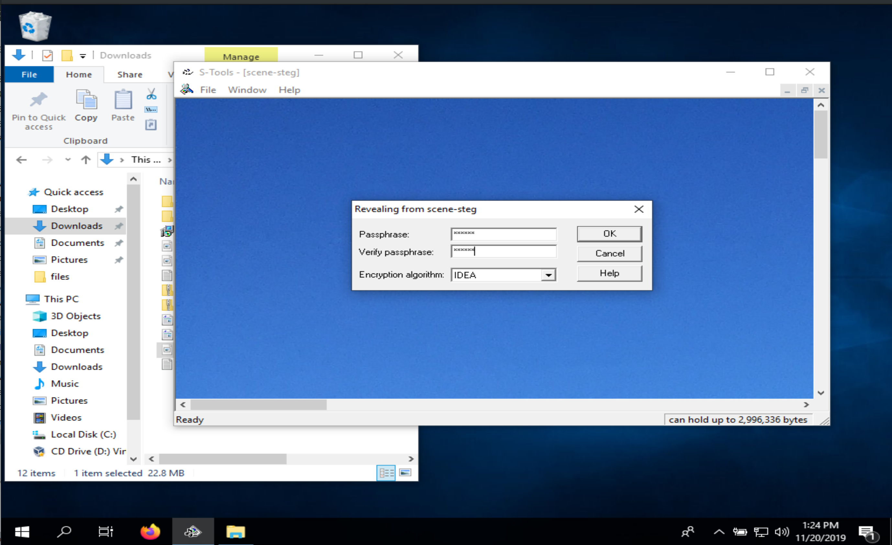  
**Figure 17:** Reveal prompting us for password and decryption algorithm.  

In the new opened window, we will right click the rtf file `hidden.rtf` and choose save as, and open the `hidden.rtf` file to view the content. Comparing it with the hidden file we used in part 3 to see if they are the same.  
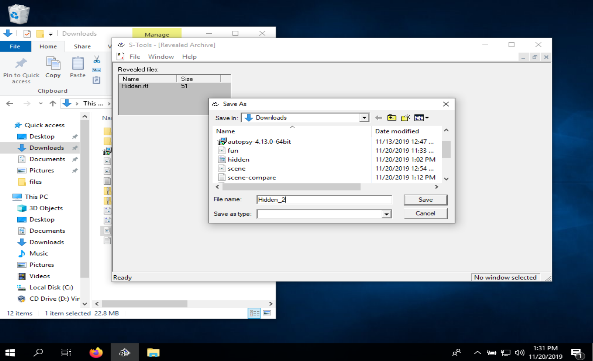  
**Figure 18:** Saving file hidden inside image.  

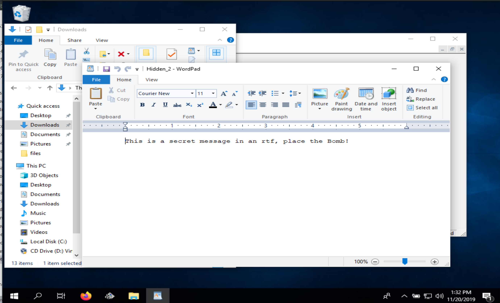  
**Figure 19:** Opening hidden file extracted from image. 

As we can see from Figure 19 the file hidden inside the image matches what we put there in Part 3.    

Now we repeat the previous steps for the file `fun-steg.bmp` to recover the hidden message.  
  
**Figure 20:** Reveal hidden data from `fun-steg.bmp`.  

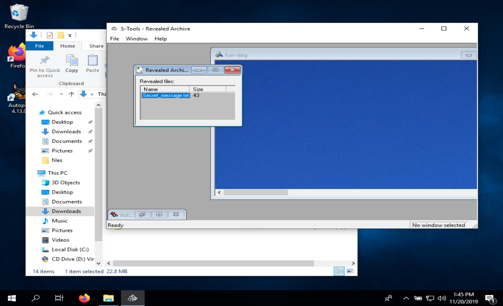  
**Figure 21:** Saving secret text file hidden inside image.  

As we can tell from Figure 22 below, the hidden file inside of the image matches what we placed there previously.  
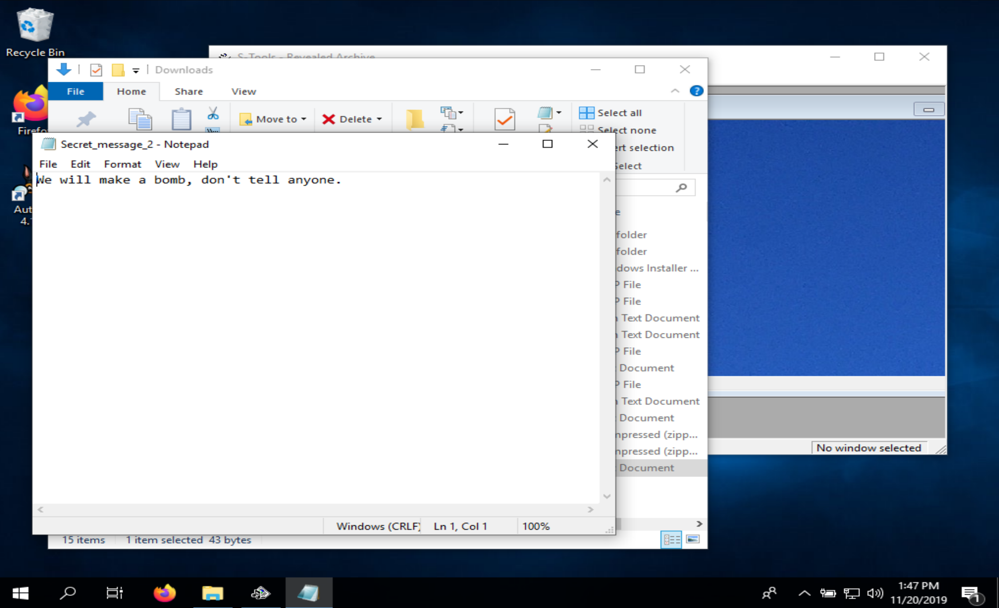  
**Figure 22:** Extracted hidden `.txt` file from `fun-steg.bmp`.


## Part 5: Data hiding and recovering using Bit-shifting

Now we will create a text file named `message.txt` in Windows. Type a message in the file: 
>This is a secret message that I want to send out.  
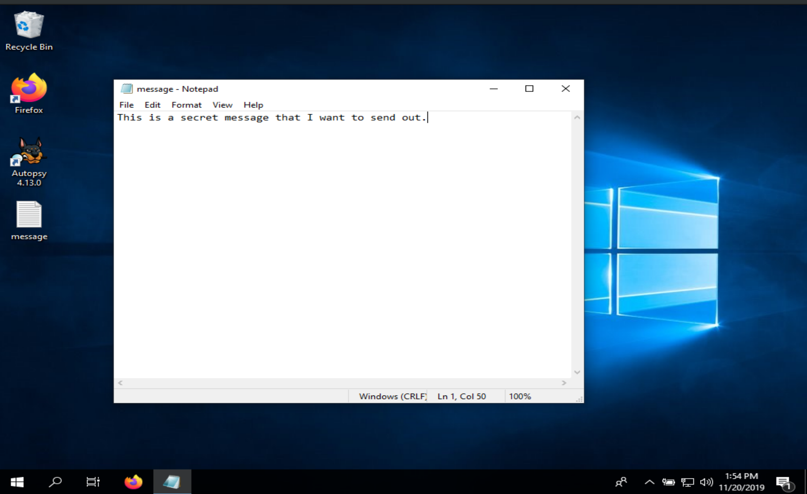  
**Figure 23:** Creating `message.txt`.  


Then we open `message.txt` in WinHex, and set the mode to editable via `Options->Edit Mode->Default Edit Mode (=editable)`.  
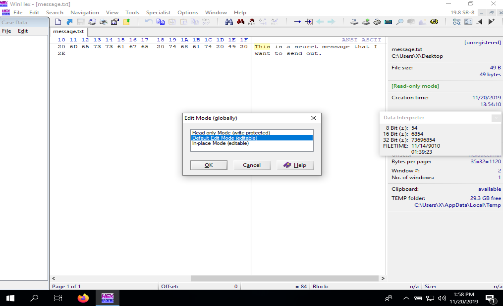  
**Figure 24:** Open `message.txt` and set mode to editable.  

To modify the data, we select all the data in the file by pressing `Ctrl+A`, and then selecting `Edit -> Modify Data`. In the Modify Block Data dialog box, we click the `Left shift by 1 bit` option, and then click OK.
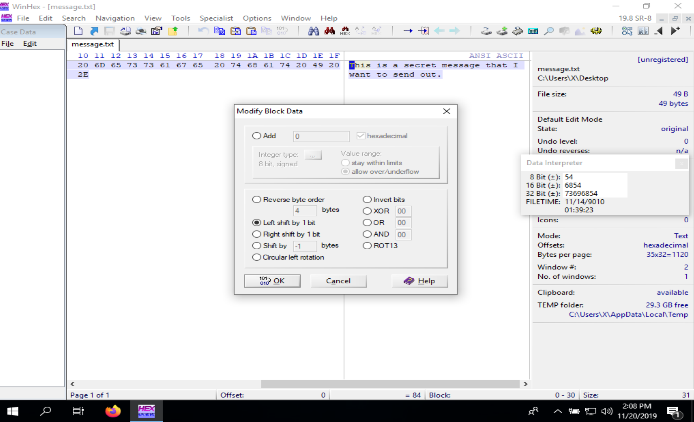  
**Figure 25:** Left shifting the data by one bit.  

We will save this file as `message-shift-left.txt` in our work folder. The text is now changed to "random..." values.  
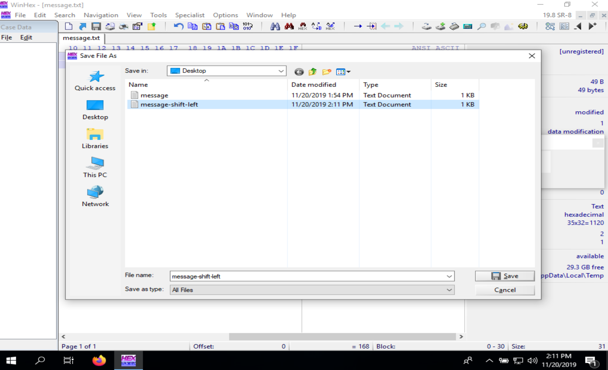  
**Figure 26:** Saving shifted bits as `message-shift-left.txt`.  

To recover the message from `message-shift-left.txt`, we need to bit-shift it back to the right.  
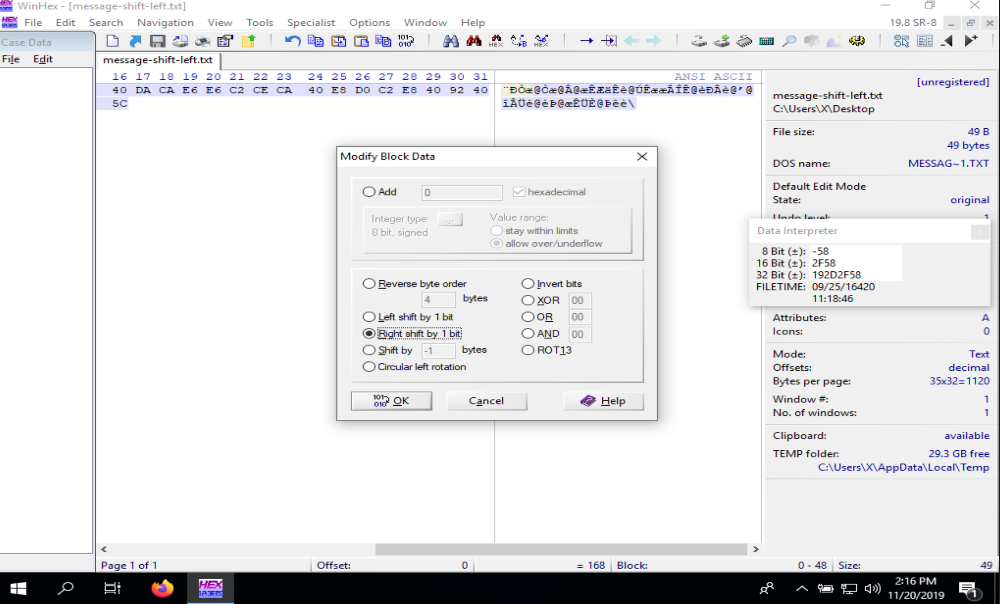  
**Figure 27:** Before shifting bits back one to the right.  

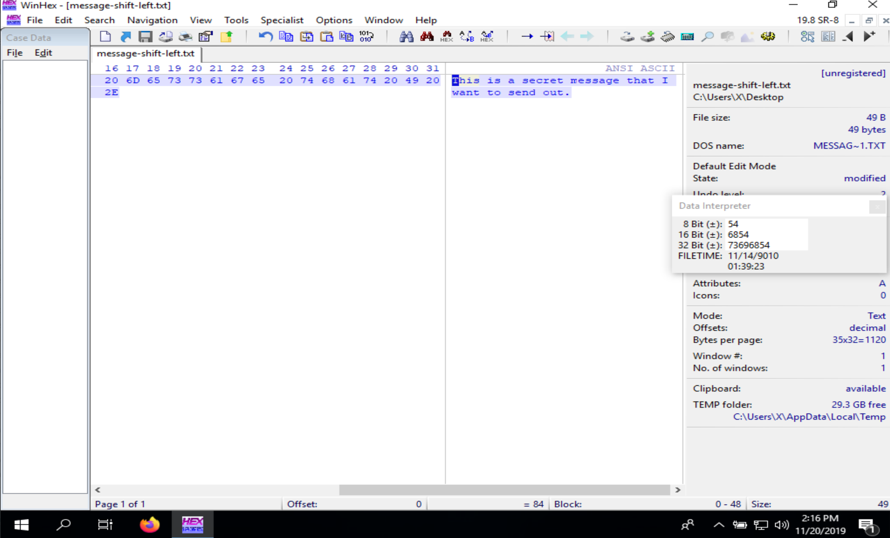  
**Figure 28:** After shifting bits back one to the right. 

We then save the file as `message-shift-right.txt` and use Winhex to compare the MD5 hash values of these three files and determine if `message.txt` is different from `message-shift-left.txt` and `message-shift-right.txt`. We will open all three files in WinHex and compute the MD5 hash values to determine if the files are different.  
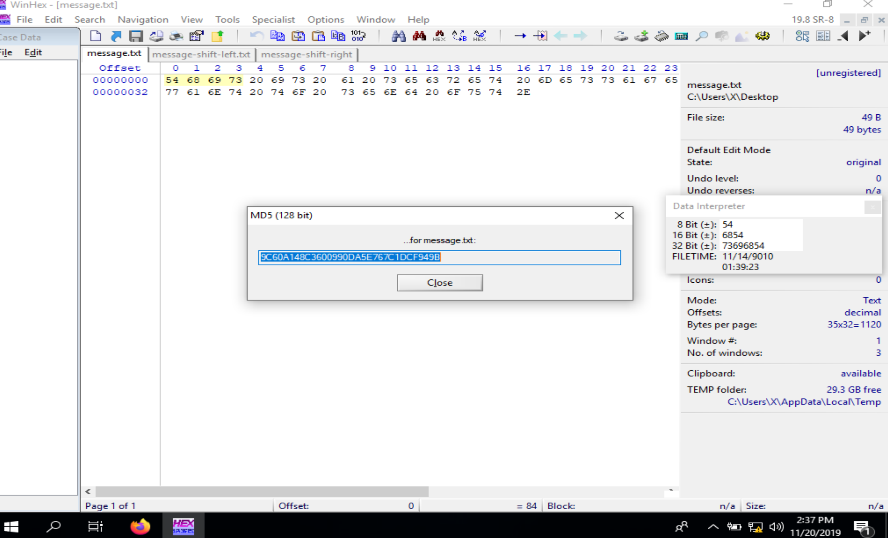  
**Figure 29:** MD5 hash for `message.txt`.  

  
**Figure 30:** MD5 hash for `message-shift-left.txt`. 

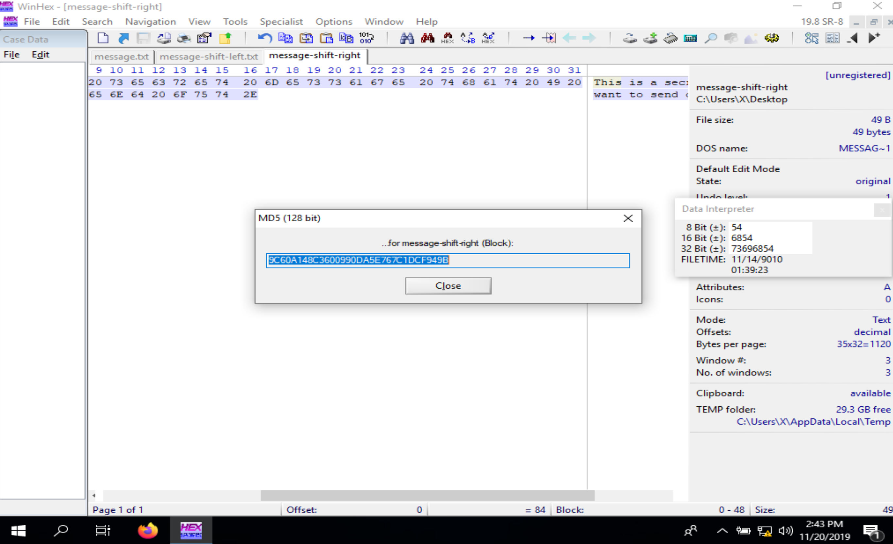  
**Figure 31:** MD5 hash for `message-shift-right.txt`. 

```
*** MD5 (128 bit) ***
...for message.txt: [9C60A148C3600990DA5E767C1DCF949B]
```

```
*** MD5 (128 bit) ***
...for message-shift-left.txt: [496DE2E2A99AC0909E861894547B7B80]
```

```
*** MD5 (128 bit) ***
...for message-shift-right.txt: [9C60A148C3600990DA5E767C1DCF949B]
```

As we can see from the hash outputs above, and in Figures 29, 30, and 31, the MD5 Hash values for `message.txt` and `message-shift-right.txt` match one another, meaning the files are identical. The hash value for `message-shift-left.txt` is not the same, because this is our psudo-encrypted file. 

## Part 6: Data hiding and recovering using XOR  


## Questions  
1. To reveal the hidden data using S-Tools, which information are required?  

2. In Part 3, Are there any differences between scene.bmp and scene-steg.bmp? Please take a screenshot to show the differences.  

3. In Part 3, Are there any differences between fun.bmp and fun-steg.bmp? Please take a screenshot to show the differences.  

4. In Part 5, among the hash values for message.txt, message-shift-right.txt, and message-shift- left.txt, which ones are the same? Please take a screenshot to prove your answer.  

5. In class, we’ve discussed that INFORMATION XOR RANDOM_NUMBER = NONSENSE. What will be generated if we do NONSENSE XOR RANDOM_NUMBER?  