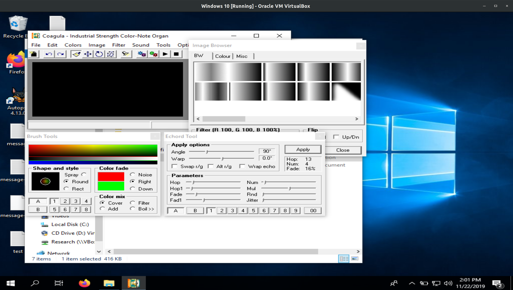
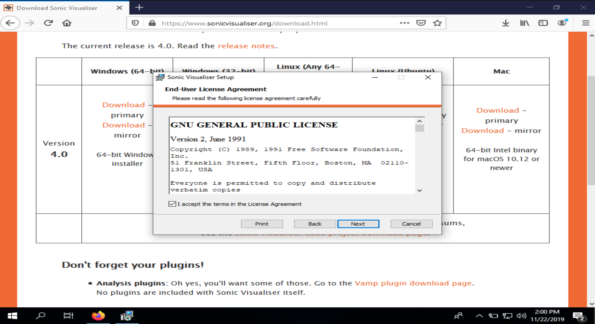
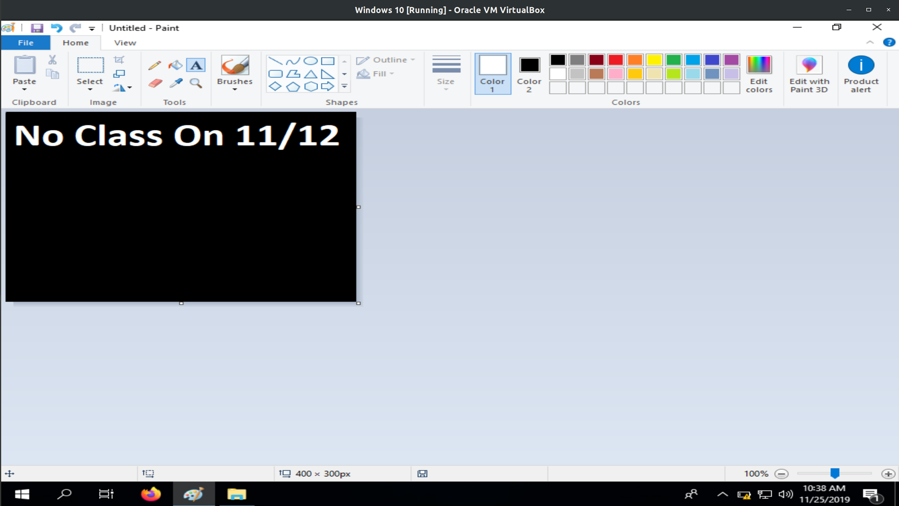
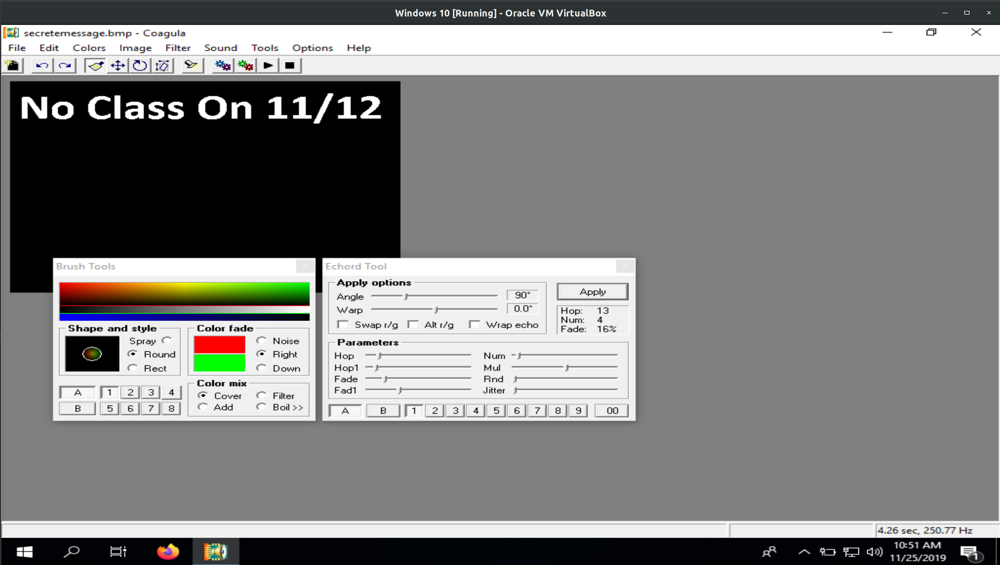
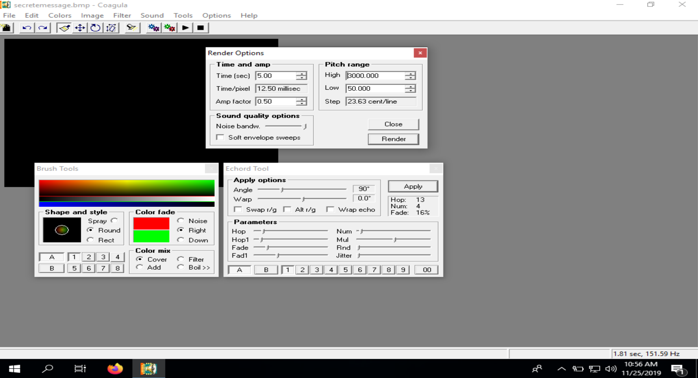
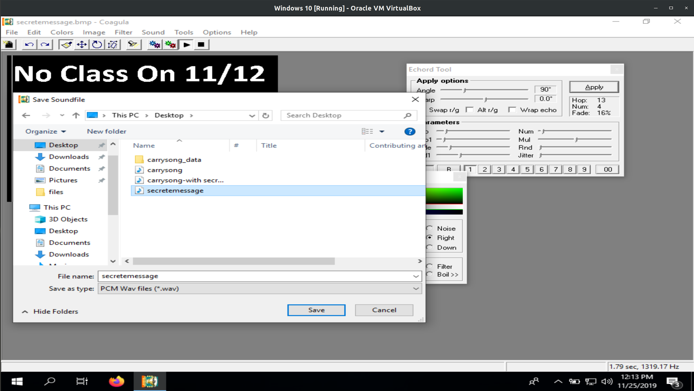

---
title: "CSC153: Activity 8 - Steganography with Audio Files"
author: Ryan Kozak
date: "2019-11-25"
subject: "CSC153 Activity 8"
keywords: [CSUS, CSC153]
lang: "en"
titlepage: true
titlepage-text-color: "FFFFFF"
titlepage-color: "004E36"
titlepage-rule-color: "C4B581"
logo: "./images/csus.png"
logo-width: 150
...

## Objectives  
* Practice steganography with audio files.

## Part 1: Software installation  
Download the following software and install them on your workstation.  

* Coagula. **[https://www.abc.se/~re/Coagula/Coagula.html](https://www.abc.se/~re/Coagula/Coagula.html)**    
  
**Figure 1:** Coagula installed.  

* Audacity. **[https://www.audacityteam.org/](https://www.audacityteam.org/)**  
  
**Figure 2:** Audacity installation.    

* Sonic Visualizer. **[https://www.sonicvisualiser.org/]([https://www.sonicvisualiser.org/)**  
  
**Figure 3:** Sonic Visualizer installation.

## Part 2: Create a steganography audio file  
Download carrysong.wav from Canvas or google drive and save it in your work directory. The
google drive link is [https://drive.google.com/file/d/1p3q6BfeA10PAq2ygxPeuPMb5VPpyYGNb/view?usp=sharing](https://drive.google.com/file/d/1p3q6BfeA10PAq2ygxPeuPMb5VPpyYGNb/view?usp=sharing).

Open the paint application, change the background color into black and front color into
white, click on the Color 2 to choose black, and click on the Color 1 to choose white. Put the mouse onto the right bottom corner of original white canvas and drag it to the left-top corner to shrink the canvas size and make the canvas disappear, and then drag it to the right bottom to create a new canvas with black color.

Click on `File->Properties` to change the canvas size to `400x300`. The canvas should not be too big or too small. Click on `A` to insert text onto the canvas. Type the secret message on the Canvas. In this instruction, it is `No class on 11/12`. Align the message to the top center of the canvas.  
  
**Figure 4:** Followed steps above to create secret message.  

Click on `File->Save` as to save the file as `secretemessage.bmp` in your work directory. Remember
to choose `24-bit Bitmap` as the type.  Navigate to the directory where the Coagula program is installed and click on Coagula to open it. Click on `File->Open Image` to open the file `secretemessage.bmp`.  
  
**Figure 5:** Opening `secretmessage.bmp` in Coagula.   

Click on Tools and click on Render Options to open the Render Options window. In the Render Options window, change the High of pitch range to `3000`, and Amp factor into `0.5`.  
  
**Figure 6:** Setting render options in Coagula.  

Click on Render Image without Blue Noise (the button with green/red gears). Click on `File->Save Sound As` to save the image as an audio file. It is saved as `secretmessage.wav` in this instruction. Click on Audacity to start the program. Click `File->Open` to open `carrysong.wav` file. Click on `File->Import->Audio` to import the `secretmessage.wav` file. Click on OK for the warning
window.   

This step needs to move the `secretmessage.wmv` to the end of `carrysong.m4v`. Click on the right end of the secretmessage and drag to the left end to select the entire piece of the audio file, right click to cut the piece (or you can press the scissor-like button on the top menu), click the position aligned with the end of carrysong, and then paste the secretmessage there by right clicking and paste (or you can press the paste button on the top menu). You may click on the zoom in or zoom out icon to zoom in/out the audio tracks.  
  
**Figure 7:** Move secret message to the end of carry song.  

In the secretmessage track, below the Mute and Solo buttons, drag the bar to move it to the very left. This will change the Gain to `-36.0 dB`. Click on `File->Export` to export the audio. Save the audio as `carrysong-with secret message.wav`.  
  
**Figure 8:** Export as `carrysong-with secret message.wav`.  

Click OK on the warning message and on the following Edit Metadata Tags window. You may play the `carrysong-with secret message.wav` file in media player.    

## Part 3: Display the secret message in a steganography audio file  

Start Sonic Visualiser program. Click on `File->Open` to open the `carrysong-with secret message.wav file`. Click on `Layer->Add Spectrogram-> carrysong-with secret message.wav: All Channels Mixed`. 

You can move around to display the secret message. You may also choose different color theme in the right column to make the message more visible, if necessary.    
  
**Figure 9:**  Secret message displayed.    

 

## Questions  
1. In Part 2 step 6, why do we change the background color into black? (hint: the image is converted to audio later).  
	*  When it's converted to audio it makes the bits appear in the visualizer much more clearly. This is why we need to make the font rather large and clear as well.  
	  
	**Figure 10:**  Secret message displayed, this is step 23.  

2. In part 2 step 19, why do we need to move the secretmessage to the end of carrysong?  
	* When we view the message in Sonic Visualizer we can see that there is a hard line visible between green and black ad the end of `carrysong`, and the secret message appears in green. If we weren't to have moved the message to the end, it would be scrambled and invisible.  
	  
	**Figure 11:**  If it weren't at the end, if the message would be lost in the green noise.   

3. Take screenshots to document what you’ve done in Step 13, 16, and 23.  
	* We save the secret message, encoded as an audio file.  
	    
	**Figure 12:** Saving `secretmessage.wmv`, this is step 13.  

	* In this step we moved `secretmessage.wmv` to the end of `carrysong.wav`.  
	  
	**Figure 13:** Moving `secretmessage.wmv` to the end of `carrysong.wav`, this is step 16.

	* We open Sonic Visualizer, then select `File->Open` and choose `carrysong-with secred message.wav`. After this we click `Layer->Add Spectrogram->carrysong-with secret message.wav: All Channels Mixed`.  
	  
	**Figure 14:**  Secret message displayed, this is step 23.  