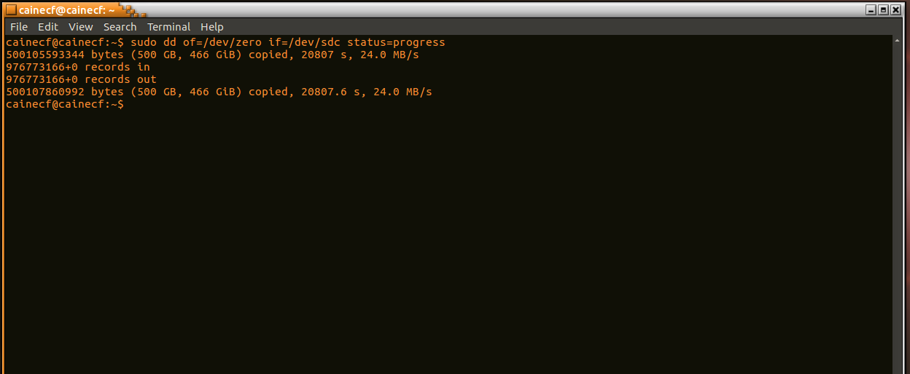

# Lab 1: Forensic Investigation on Your Own Personal Computer
### CSC 153 - Computer Forensics Principles and Practice

## Introduction  
For this lab we were to conduct a forensics investigation on our own PC, using any case management tools we so choose. Options presented to us included [OSForensics](https://www.osforensics.com/), [FTK](https://accessdata.com/products-services/forensic-toolkit-ftk), [Sleuthkit/Autopsy_Browser](https://www.sleuthkit.org/), [Encase](https://www.guidancesoftware.com/encase-forensic), and [ProDiscover Basic](https://www.prodiscover.com/).

I've used [Sleuthkit](https://www.sleuthkit.org/) and the [Autopsy](https://www.sleuthkit.org/autopsy/) browser, only because I do not have a Windows machine on which to run any of the other software. I began this lab using Autopsy 2, and then switched to Autopsy 4 for the later portions. This will be apparent in the screenshots taken throughout the process.

## Note
This lab took me **significantly** longer than it was intended to. I spent probably 40+ hours on it. Largely, this was because I have encrypted installations of Ubuntu Linux on all my machines, and I couldn't just install OSForensics and run a live acquisition like I'm assuming 99% of people did for this lab.

## Data Acquisition  
In preparation for this Lab I've installed [CAIN 10.0](https://www.caine-live.net/) onto a flash drive. I also have a virtual machine of [CAIN 9.0](https://www.caine-live.net/) running on my desktop which I used for certain portions. I attempted to install Autopsy 4 on my laptop directly in order to do a live acquisition, but that simply wasn't possible. Github is full of *[unresolved issues](https://github.com/sleuthkit/autopsy/issues)* related to OSX and Linux installations. Their product is built for Windows first, and other operating systems are just an afterthought, this has become more than apparent to me.

### Preparing the Evidence Drive  

 The computer I'll be investigating for this lab is my laptop, which has a 256GB SSD with Ubuntu 16.04 installed. So, the first thing to be done is prepare my evidence drive, which is 500GB hard disk, large enough to fit an image of my laptop's entire drive. The drive on my laptop is `/dev/sda`, the CAIN live USB is `/dev/sdb`, and the evidence drive is `/dev/sdc`.

 
 **Figure 1:** Output of disks on machine.

**Figure 2:** Evidence drive zeroed out.

**Figure 3:** Creating Linux partition on evidence drive.

**Figure 4:** Creating Linux ext4 file system on newly created partition.

### Creating an Image  

After the evidence drive was ready I mounted it at `/mnt/sdc1`, created a new directory called `case1` and generated a pre-image hash of my laptop's drive.

**Figure 5:** Mounting evidence drive and generating hash of target drive into case directory.

Next I created an image of my laptop's drive, which was also saved into the `case1` directory.

**Figure 6:** Creating an image of the laptop's disk, placing it in `case1` directory.

Once the image of the disk was completed, I verified the integrity by comparing the md5 pre and post image hashes.  

**Figure 7:** Integrity if image verified using md5.

## Forensic Investigation

### Autopsy 2

### Autopsy 4

## Investigation Results  
With my setup, some of these bullet points are simply not possible to determine.

1. Provide screenshots of the following information

    * Number and type of documents (Word, Power Point, Excel, etc).
    * Number of images.

    * Number and types of encrypted files.

    * Number of executable files.

    * Number of deleted files.
      * This cannot be determined, encrypted home directories prevent this type of analysis. It's actually written into the Autopsy documentation.  

    * Size of unallocated space.
      * This cannot be determined. With an encrypted disk everything looks like nonsense.

    * Top 20 websites visited.

2. Do a search to determine the number of times your name, and typical places your name appeared.

3. Do a search to determine the number of times CSUS or Sac State appeared and typical places where it appeared.

4. Any surprising information you least expected to find.
    * No, I found nothing that surprised me. What surprised me was how much encryption actually protects you from this type of analysis. Even knowing my own encryption key didn't make this process as easy as it would have been had the drive not been encrypted at all. For instance, analysis of deleted files is impossible still, analysis of unallocated space is impossible still, and the time it took to do the analysis was 500% longer.

## Conclusion  
Encryption sure does keep you safe from prying eyes, but if you take a forensics class that tells you to analyze your own drive then your at war with yourself. I could have installed Windows and created dummy data for this Lab, and at a certain point I really considered it. However, I'd come so far in the process of actually doing this exercise on my real machine that I did not want to throw all that work away and turn in a boring lab report.
