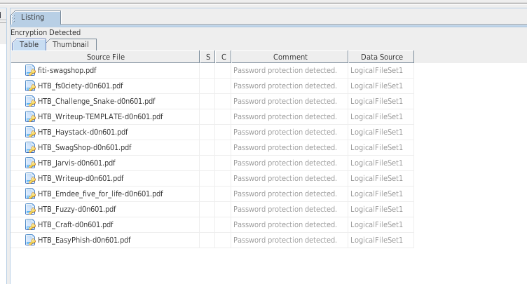

# Lab 1: Forensic Investigation on Your Own Personal Computer
### CSC 153 - Computer Forensics Principles and Practice

## Introduction  
For this lab we were to conduct a forensics investigation on our own PC, using any case management tools we so choose. Options presented to us included [OSForensics](https://www.osforensics.com/), [FTK](https://accessdata.com/products-services/forensic-toolkit-ftk), [Sleuthkit/Autopsy_Browser](https://www.sleuthkit.org/), [Encase](https://www.guidancesoftware.com/encase-forensic), and [ProDiscover Basic](https://www.prodiscover.com/). I've used [Sleuthkit](https://www.sleuthkit.org/) and the [Autopsy](https://www.sleuthkit.org/autopsy/) browser, only because I do not have a Windows machine on which to run any of the other software.

## Note
This lab took me **significantly** longer than it was intended to. I spent probably 40+ hours on it. Largely, this was because I have encrypted installations of Ubuntu Linux on all my machines, and I couldn't just install OSForensics and run a live acquisition like I'm assuming 99% of people did for this lab.

## Data Acquisition  
In preparation for this Lab I've installed [CAIN 10.0](https://www.caine-live.net/) onto a flash drive, and this is the drive from which I ran the lab.  

### Preparing the Evidence Drive  

 The computer I'll be investigating for this lab is my laptop, which has a 256GB SSD with Ubuntu 16.04 installed. So, the first thing to do was prepare my evidence drive, which is a 500GB hard disk, large enough to fit an image of my laptop's entire drive. The drive on my laptop is `/dev/sda`, the CAIN live USB is `/dev/sdb`, and the evidence drive is `/dev/sdc`.

 
 **Figure 1:** Output of disks on machine.

**Figure 2:** Evidence drive zeroed out.

**Figure 3:** Creating Linux partition on evidence drive.

**Figure 4:** Creating Linux ext4 file system on newly created partition.

### Creating an Image  

After the evidence drive was ready I mounted it at `/mnt/sdc1`, created a new directory called `case1` and generated a pre-image hash of my laptop's drive.

**Figure 5:** Mounting evidence drive and generating hash of target drive into case directory.

Next I created an image of my laptop's drive, which was also saved into the `case1` directory.

**Figure 6:** Creating an image of the laptop's disk, placing it in `case1` directory.

Once the image of the disk was completed, I verified the integrity by comparing the md5 pre and post image hashes.      

**Figure 7:** Integrity if image verified using md5.

## Forensic Investigation

### Analyzing the Disk Image
The first step to the investigation was opening Autopsy and creating a new case.  

**Figure 8:** Opening Autopsy and creating new case.

**Figure 9:** One of the basic info pages to be filled out creating the case.

Once the case was created, it was time to add a data source. Initially the image taken of the drive was added and analyzed.

**Figure 10:** Adding data source type of "Disk Image".

**Figure 11:** Adding `image.dd` as the disk image.

When the image is being analyzed we can see that it's going to be an encrypted file system (see figure 12).

**Figure 12:** Encrypted file system on `image.dd`.

Now at this point I ran into a big issue. There was almost no useful information apparent. We need to decrypt the image, see below.

### Mounting and Decrypting the Disk Image  
In order to decrypt the disk image we first mount it under `/mnt/sda1`.

**Figure 13:** Mount `image.dd` to `/mnt/sda1`

Once the was mounted we're able to navigate it as though it's another disk on the system. I navigated to the encrypted home directory to begin the decryption process.

**Figure 14:** Encrypted directory.

**Note:** If I did not have my own 32 character decryption key the rest of this lab would end here, and there would be no way to analyze anything. This is the point at which police typically need to forcibly get the key out of the suspect (beat them, threaten them, whatever).

**Figure 15:** File system decryption using key.

After this step my home folder was mounted to `/tmp/ecryptfs.gVp3gNa0`. This was then added as a new Data Source to Autopsy for analysis.  

**Figure 16:** Adding the decrypted directory to as the new data source.

**Figure 17:** Autopsy going through the decrypted files for analysis, `.gradle` directory being parsed in image.

After this ran for a few hours (more like 9 or 10) it finished. Below are the results.

## Investigation Results  
With my setup, some of these bullet points are simply not possible to determine.

1. Provide screenshots of the following information

    * Number and type of documents (Word, Power Point, Excel, etc).
      * The total number of documents is **957**. This was determined by opening up the file tree, and selecting the "Documents" option. As you can see in figure 18 the breakdown goes 190 HTML documents, 124 office documents, 211 PDFs, 426 plain text files, and 6 rich text files.  
      
      **Figure 18:** Total number of documents found.

    * Number of images.
      * The total number of images on my hard drive was **12,597**. This was determined by opening up the file tree, and selecting the "Images" option. See figure 19 below.
      
      **Figure 19:** Total number of images found.

    * Number and types of encrypted files.
      * Autopsy only detected **12** encrypted files on my machine, which I know as a fact is wrong. These are PDF's for CTF writeups that I've password protected using *PDFtk*. It considered my *TrueCrypt* container to me "suspected as encrypted", which is funny. It also totally missed my KeePassX database.  
      
      **Figure 20:** Autopsy only found my password protected PDFs, not all the encrypted files :)

    * Number of executable files.

    * Number of deleted files.
      * This cannot be determined. In order to analyze the encrypted home directory we must first decrypt it, and then add it as a "Logical File" source. According to Autopsy's documentation logical file sources cannot find deleted files or unallocated space, see quote and reference below.  
      > It will not look at unallocated space or deleted files. Autopsy will only be able to see the allocated files. You should add the device as a "Logical Drive" to analyze the unallocated space. **[User Docs 4.13](http://sleuthkit.org/autopsy/docs/user-docs/4.13.0//ds_page.html)**.

      * When the "Logical Drive" reference above is encrypted, we're out of luck.

      * Potentially the SSD is/would be another factor here, that I'm just speculating on though.

    * Number of files in slack space
      * This cannot be determined for the same reason as stated above.

    * Size of unallocated space.
      * This cannot be determined for the same reason as stated above.

    * Top 20 websites visited.
      * I was fairly certain this would yield nothing, and it didn't. I only use FireFox in private mode, no cookies or history stored. Although Autopsy analyzed my `~/.mozilla/firefox` directory, it was unable to find any websites visited, or settings stored. Again, I've never stored this information because I was already very aware people could analyze it if my computer is ever stolen.

    * Types of external devices (eg. USB, printer, etc.) connected to the computer
      * This was not possible to determine. I don't know if Autopsy offers it as a feature, especially given that this wasn't a live acquisition. There was nothing to report in the category of external devices.

2. Do a search to determine the number of times your name, and typical places your name appeared.

3. Do a search to determine the number of times CSUS or Sac State appeared and typical places where it appeared.
      * The phrase `CSUS` appeared 15 times. It appeared in my working assignment directory for CSC153 and CSC154, exactly where I'd have expected to find that keyword (see figure 21).
      
      **Figure 21:** The phrase CSUS, appears 15 places.

4. Any surprising information you least expected to find.
    * I'm a bit surprised Autopsy didn't detect my KeePassX database as an encrypted file, and only considered my TrueCrypt container to be "Suspected" as an encrypted file. The number of images was higher than I anticipated too. What surprised me more was how much file system encryption actually protects you from this type of analysis. Even knowing my own encryption key didn't make this process as easy as it would have been had the drive not been encrypted at all.

## Conclusion  
Encryption sure does keep you safe from prying eyes, but if you take a forensics class that tells you to analyze your own drive then your at war with yourself. I could have installed Windows and created dummy data for this Lab, and at a certain point I really considered it. However, I'd come so far in the process of actually doing this exercise on my real machine that I did not want to throw all that work away and turn in a boring lab report. I learned **a lot** doing this lab, and I think that was the whole point.
