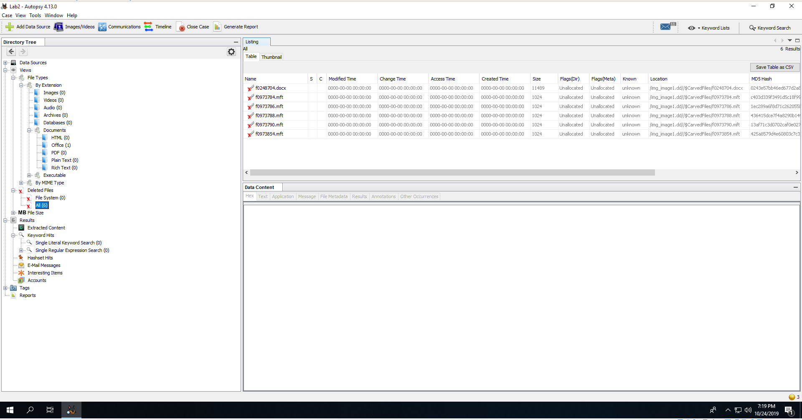
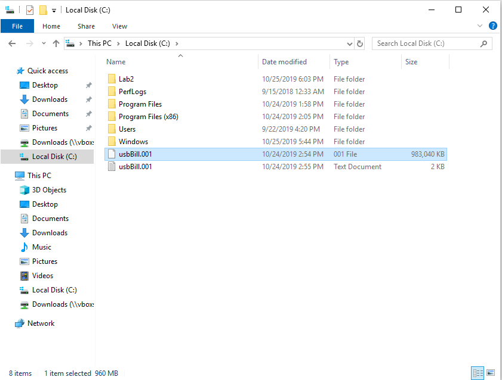

# Lab 2: Data Acquisition and Basic Forensic Analysis
### CSC 153 - Computer Forensics Principles and Practice

## Objectives
* Perform Data Acquisition using FTK imager and Linux dd, dcfldd commands.
* Learn to use the Windows version Autopsy (version 4).
* Locate deleted/hidden files.
* Perform a dirty word search.
* Create a case report with any evidence you find.
* Understand the difference between disk formatting in Windows and zero-out.

# Tasks   

### Task 1: Software Preparation.
The first task is to get our forensic tools downloaded and installed. FTK Imager and Autopsy 4 are to be installed on Windows and CAINE 9 is installed as a virtual machine. For this lab I'll be using an Ubuntu 18 host, running Virtual Box with virtual machines for Windows 10 and CAIN 9.

FTK Imager 4.2.1 was downloaded from **[here](https://accessdata.com/product-download/ftk-imager-version-4.2.1)** onto the Windows 10 virtual machine, and installed.

**Figure 1:** Installation of FTK Imager.

Autopsy 4.13 was downloaded from **[here](https://www.sleuthkit.org/autopsy/download.php)** onto the Windows 10 virtual machine, and installed.  
  
**Figure 2:** Installation of Autopsy.

The lab states *"Install a CAINE or Kali Linux virtual machine following the instructions of our in-class activity 1. You may skip this step if you decide to use the lab machines in RVR2009 to perform the steps involving Linux."*. Because I completed activity 1 on my home machine, between the first and second class periods we were allowed to work on it, a CAIN 9 virtual machine was ready to go for me before beginning this lab.  
  
**Figure 3:** CAIN 9 ready to go on Virtual Box.  

### Task 2: Prepare a suspect drive.  
The second task was to find a USB drive with the size of 500MB-2GB to work as the suspect drive. For this lab I'll be using a 1GB flash drive. **Note:** I have zeroed out this drive a few times already for this class, and just installed the file system prior to this lab.

We first connect the drive to the Windows virtual machine, and a file named `test.docx` is created via Microsoft Word. The  contents of this file are the following.  
> Life does not provide Warranties and Guarantees it only provides possibilities and opportunities for those who there to make best use of it!. 

  
**Figure 4:** Creating `test.docx` on the Windows machine.

After this file was saved onto the USB drive, we right click on the drive and perform a disk format.    

  
**Figure 5:** Formatting the USB drive on Windows, right after creating our `test.docx`.  

### Task 3: Perform a data acquisition with FTK Imager.  

Next, we perform data acquisition with FTK Imager, which was installed in Step 1, and choose `File->Create Disk Image`.  In the Select Source dialog box, we click the Physical Drive option, and then click Next.   

In the Select Drive dialog box, we click the Source Drive Selection list arrow, click on suspect drive,
and then click Finish.  
    
**Figure 6:** Selecting the suspect drive as physical source on FTK Imager.

In the Create Image dialog box, we select *“Verify images after they are created”*, and then click *“Add”*. Then, we select *“Raw”* as the Destination Image Type.  
  
**Figure 7:** Raw data selected as destination image type on FTK Imager.

Complete the case information, and then click Next.  

**Figure 8:** Completing evidence item information.

Next we click to the Select Image Destination dialog box, click Browse and specify the location we're storing the image. Also, we click to clear the Use AD Encryption check box.
  
**Figure 9:** Selecting where to store the image file.

It's now time we start to initiate the acquisition.  

**Figure 10:** Ready to start the image creation.  

  
**Figure 11:** FTK creating the image.  

Lastly, we review the information in the Drive/Image Verify Results dialog box.  
  
**Figure 12:** Image Summary.  

### Task 4: Perform a data acquisition with Linux dd/dcfldd command.  
Next we open up the CAINE 9 virtual machine, and follow the instructions of in-class activity 3 to
perform data acquisition of the USB drive using Linux dd/dcfldd commands.

The first step in activity 3 was to locate and then zero the drive on which we're to copy our evidence. I've included this part because it was part of activity 3.  

  
**Figure 13:** `/dev/sdb1` is our evidence drive, `/dev/sdc1` is our target.

  
**Figure 14:** Zero out the target drive before acquisition.

Next we create a partition, and a file system on the target drive.

  
**Figure 15:** Creating a partition on `/dev/sdc`.

  
**Figure 16:** Write W95 FAT 32 (LBA) .

  
**Figure 17:** Make FAT 32 file system on the new partition.  

At this point, we're ready to mount the to store a copy of our evidence, and evidence hashes.  
  
**Figure 18:** Mounting drive to copy our evidence to.

Once our target drive is mounted, we create a `case1` directory, and acquire the data.  
  
**Figure 19:** Acquisition of data to `case1` directory with `dcfldd`.

After acquisition is complete we verify the image by checking the the values of the `pre-imagesource.md5.txt` and `post-imagesource.md5.txt` contain the same hash value.  
  
**Figure 20:**  Verified acquisition by checking `md5sum` results.

Now there is an `image1.dd` file created from our evidence drive. It's time to analyze this in Autopsy, so we transfer the evidence drive to our Windows virtual machine.

### Task 5: Analyze the acquired data.  

We open Autopsy in our Windows VM that we installed in Task 1, and create a new case.

  
**Figure 21:** Creating Lab2 case in Autopsy.  

Next, we add the image by choosing Disk Image or VM File.

  
**Figure 22:** Select to add a disk image file.

For our data source, we select the raw image acquired via `dcfldd`.
  
**Figure 23:** Data source is image `image1.dd`.  

  
**Figure 24:** All modules configured.

We click on *Data Sources* to view the image. Next we navigate to the tabs under *Views* to check the files on this USB drive. Because I've been using this drive for CSC 153 already, it's been zeroed a couple of times previously. The only file on this drive is the file we've placed on here in Task 2, `test.docx`.  However, that appears as a deleted file, due to our formatting of the drive in Task 2 directly after creating the file. So, we click on deleted files to see the deleted files.

  
**Figure 25:** There is one deleted `.docx` file, and `mft` records, nothing more.

We can examine this deleted file `f0248704.docx` by right-clicking on the file, choosing *Extract file*.
  
**Figure 26:** Extracted deleted `.docx` file.

When we open `f0248704.docx` in Microsoft Word, we see that the contents are that or our `test.docx` file. The file was deleted by the disk formatting performed in Task 2, but we've recovered it.  
  
**Figure 27:** Contents of the deleted file match `test.docx`.

### Task 6: Perform a dirty word search.

For the purposes of this lab we will just use *Warranties* as the key word for our dirty word search, as we're aware that this word is in our deleted file.

We click on the “Keyword Search” button, ensure ASCII, and Case Insensitive are selected, and type in *Warranties*.

  
**Figure 28:** Keyword (dirty word) search results for *Warranties*.

**When you get a hit, make a note of the sector the hit was in. You will be able to determine what
file the hit was located in by comparing the sector the word was found in with the sectors listed
in the file reports you made during the file analysis.**

### Task 7: Zero-out the suspect USB drive.

Now we are going to zero-out the suspect USB drive. First we connect the same suspect USB drive back up to our CAIN virtual machine. In our case it's at `/dev/sdb`. **Then, we zero-out the drive**.  
  
**Figure 29:** Zero-out the suspect drive.

### Task 8: Repeat Tasks 4-6.

We now begin to repeat the activities 4-6 towards the zeroed-out USB drive. For activity 4, we do not need to zero out the drive on which we store evidence, or create a case directory. That part was to ensure a safe place to store evidence, and it still is.  

So, at this point we acquire an image of the drive again using `dcfldd` and compare the hashes once more to confirm integrity.  
  
**Figure 30:** Acquiring `image1_zerod.dd` of suspect drive after zero-out.  

  
**Figure 31:** Verify `image1)zerod.dd` with previously calculated hash of the zeroed drive.

### Task 9: Answer the questions. Please attach screenshots to prove your answers when necessary.  

1. **In Task 4, the acquired image has an extension of “.dd”. In Task 3, what is the extension for the
image file?**

  FTK uses an extension of `.001`. We can discover this by looking at the output of FTK Imager, and seeing the file we created is `usbBill.001`.  
    
  **Figure 32:** File created by FTK Imager has `.001` extension, see `usbBill.001`.

2. **In Task 5, how many files are there on the USB drive? What are they? Please attach screenshots
to prove your answer.**
   Because the drive had been zeroed out twice due to previous activities in the class. All the files on the drive were deleted files, and all these files were `.mft` files except for the single `.docx` we created in task 2.  
     
   **Figure 33:** There are no files that aren't deleted existing on the drive.

3. **In Task 5, which file/files are deleted? Please attach screenshots to prove your answer.**  
   Because the drive had been zeroed out twice due to previous activities in the class. All the files on the drive were deleted files, and all these files were `.mft` files except for the single `.docx` we created in task 2.

4. **In Task 6, are you able to find any hit when you search “Warranties” as the key word? In which
file is the key word located? Please attach screenshots to prove your answer.**  

5. **In Task 8, how many files are there on the USB drive? What are they? Please attach screenshots
to prove your answer.**  

6. **In Task 2, you performed a “disk format” operation towards the USB drive. Did this operation
completely erase the “test.doc” (or “test.docx”) file in the USB drive? How do you know? Please
provide a screenshot to prove your answer.**  

7. **In Task 7, you performed a “zero out” operation towards the USB drive. Did this operation
completely erase the “test.doc” (or “test.docx”) file in the USB drive? How do you know? Please
provide a screenshot to prove your answer.**  

8. **Did have any surprise in Task 5? Did you see any other files other than “test.doc” or “test.docx”?
Please provide a screenshot to prove your answer.**  

9. **In Task 8, did you see any other files other than “test.doc” or “test.docx”? Please provide a
screenshot to prove your answer.**  

10. **To summarize the questions above, what are the difference between disk formatting in
Windows and the zero-out operation?**  
