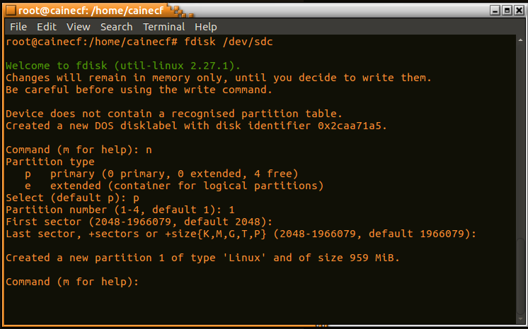

# Lab 2: Data Acquisition and Basic Forensic Analysis
### CSC 153 - Computer Forensics Principles and Practice

## Objectives
* Perform Data Acquisition using FTK imager and Linux dd, dcfldd commands.
* Learn to use the Windows version Autopsy (version 4).
* Locate deleted/hidden files.
* Perform a dirty word search.
* Create a case report with any evidence you find.
* Understand the difference between disk formatting in Windows and zero-out.

# Tasks   

### Task 1: Software Preparation.
The first task is to get our forensic tools downloaded and installed. FTK Imager and Autopsy 4 are to be installed on Windows and CAINE 9 is installed as a virtual machine. For this lab I'll be using an Ubuntu 18 host, running Virtual Box with virtual machines for Windows 10 and CAIN 9.

FTK Imager 4.2.1 was downloaded from **[here](https://accessdata.com/product-download/ftk-imager-version-4.2.1)** onto the Windows 10 virtual machine, and installed. 

**Figure 1:** Installation of FTK Imager.

Autopsy 4.13 was downloaded from **[here](https://www.sleuthkit.org/autopsy/download.php)** onto the Windows 10 virtual machine, and installed.  
  
**Figure 2:** Installation of Autopsy.

The lab states *"Install a CAINE or Kali Linux virtual machine following the instructions of our in-class activity 1. You may skip this step if you decide to use the lab machines in RVR2009 to perform the steps involving Linux."*. Because I completed activity 1 on my home machine, between the first and second class periods we were allowed to work on it, a CAIN 9 virtual machine was ready to go for me before beginning this lab.  
  
**Figure 3:** CAIN 9 ready to go on Virtual Box.  

### Task 2: Prepare a suspect drive.  
The second task was to find a USB drive with the size of 500MB-2GB to work as the suspect drive. For this lab I'll be using a 1GB flash drive purchased on Amazon, brand unknown. **Note:** I have zeroed out this drive a few times already for this class.

The drive was connected to the Windows virtual machine, and a file named `test.docx` was created via Microsoft Word. The contents of this file were the following.  
> Life does not provide Warranties and Guarantees it only provides possibilities and opportunities for those who there to make best use of it!  

  
**Figure 3:** Creating `test.docx` on the Windows machine.

After this file was saved onto the USB drive, we right click on the drive and perform a disk format.    

  
**Figure 4:** Formatting the USB drive on Windows, right after creating our `test.docx`.  

### Task 3: Perform a data acquisition with FTK Imager.  

Next, we perform data acquisition with FTK Imager, which was installed in Step 1, and choose `File->Create Disk Image`.  In the Select Source dialog box, we click the Physical Drive option, and then click Next.   

In the Select Drive dialog box, we click the Source Drive Selection list arrow, click on suspect drive,
and then click Finish.  
    
**Figure 5:** Selecting the suspect drive as physical source on FTK Imager.

In the Create Image dialog box, we select *“Verify images after they are created”*, and then click *“Add”*. Then, we select *“Raw”* as the Destination Image Type.  
  
**Figure 6:** Raw data selected as destination image type on FTK Imager.

Complete the case information, and then click Next.  

**Figure 7:** Completing evidence item information. 

Next we click to the Select Image Destination dialog box, click Browse and specify the location we're storing the image. Also, we lick to clear the Use AD Encryption check box.
  
**Figure 8:** Selecting where to store the image file.

It's now time we start to initiate the acquisition.  

 
**Figure 8:** Ready to start the image creation.  

  
**Figure 9:** FTK creating the image.  

Lastly, we review the information in the Drive/Image Verify Results dialog box.  
  
**Figure 10:** Image Summary.  

### Task 4: Perform a data acquisition with Linux dd/dcfldd command.  
Next we open up the CAINE 9 virtual machine, and follow the instructions of in-class activity 3 to
perform data acquisition of the USB drive using Linux dd/dcfldd commands. 

The first step in activity 3 was to locate and then zero the drive on which we're to copy our evidence. I've included this part because it was part of activity 3.  

  
**Figure 11:** `/dev/sdb1` is our evidence drive, `/dev/sdc1` is our target.

  
**Figure 12:** Zero out the target drive before acquisition.

Next we create a partition, and a file system on the target drive.

  
**Figure 13:** Creating a partition on `/dev/sdc`.

  
**Figure 14:** Write W95 FAT 32 (LBA) .

  
**Figure 15:** Make FAT 32 file system on the new partition.  

At this point, we're ready to mount the evidence drive to store a copy of our evidence, and evidence hashes.  
  
**Figure 16:** Mounting our evidence drive.

Once our target drive is mounted, we create a `case1` directory, and acquire the data.  
  
**Figure 17:** Acquisition of data to `case1` directory with `dcfldd`.

After acquisition is complete we verify the image by checking the the values of the `pre-imagesource.md5.txt` and `post-imagesource.md5.txt` contain the same hash value.  
  
**Figure 18:**  Verified acquisition by checking `md5sum` results.

Now there is an `image1.dd` file created from our evidence drive. It's time to analyze this in Autopsy, so we transfer the evidence drive to our Windows virtual machine.

### Task 5: Analyze the acquired data.  

We open Autopsy in our Windows VM that we installed in Task 1. 

17. Create a new case and add the image by choosing Disk Image or VM File.

18. Choose the raw image you acquired in step 15.

19. Select all, and click on Next.

20. Click on Finish.

21. Click on Data Sources to view the image.

22. Click on the tabs under “Views” to check the files on this USB drive.

23. Click on deleted files to see the deleted files.

24. You may check the content for each file by clicking on that file. You can also download a file by right-click on the file, choose “Extract file”, and then save it to a directory. You can then try toview the file on your machine. For example, I tried to open the “where were you.mp3” file in my machine, but found I cannot open it.

### Task 6: Perform a dirty word search.

25. A dirty word search is a search through all of the bytes in the image looking for specific strings or
words. Look at the information listed in the case summary, and consider what words a suspect
might use. This search takes some time. Normally a forensic analyst would have a long list of
dirty words ready. For demonstration, in this lab just use the “Warranties” as the key word.

26. Click on the “Keyword Search” button.

27. Ensure ASCII, and Case Insensitive are selected. Type in a dirty word from your list. Click the
“Search” button.

28. When you get a hit, make a note of the sector the hit was in. You will be able to determine what
file the hit was located in by comparing the sector the word was found in with the sectors listed
in the file reports you made during the file analysis.

### Task 7: Zero-out the suspect USB drive.

29. Connect the same suspect USB drive you used in this lab to the CAINE/Kali Linux again. Zero-out
the suspect drive by following the instructions in our In-class Activity 3. This step is very
important. Please don’t skip this step.

### Task 8. Repeat Task 4-6.

30. Repeat the activities 4-6 towards the zeroed-out USB drive.

### Task 9: Answer the questions. Please attach screenshots to prove your answers when necessary.  

1. In Task 4, the acquired image has an extension of “.dd”. In Task 3, what is the extension for the
image file?

2. In Task 5, how many files are there on the USB drive? What are they? Please attach screenshots
to prove your answer.

3. In Task 5, which file/files are deleted? Please attach screenshots to prove your answer.  

4. In Task 6, are you able to find any hit when you search “Warranties” as the key word? In which
file is the key word located? Please attach screenshots to prove your answer.  

5. In Task 8, how many files are there on the USB drive? What are they? Please attach screenshots
to prove your answer.  

6. In Task 2, you performed a “disk format” operation towards the USB drive. Did this operation
completely erase the “test.doc” (or “test.docx”) file in the USB drive? How do you know? Please
provide a screenshot to prove your answer.  

7. In Task 7, you performed a “zero out” operation towards the USB drive. Did this operation
completely erase the “test.doc” (or “test.docx”) file in the USB drive? How do you know? Please
provide a screenshot to prove your answer.  

8. Did have any surprise in Task 5? Did you see any other files other than “test.doc” or “test.docx”?
Please provide a screenshot to prove your answer.  

9. In Task 8, did you see any other files other than “test.doc” or “test.docx”? Please provide a
screenshot to prove your answer.  

10. To summarize the questions above, what are the difference between disk formatting in
Windows and the zero-out operation?  
