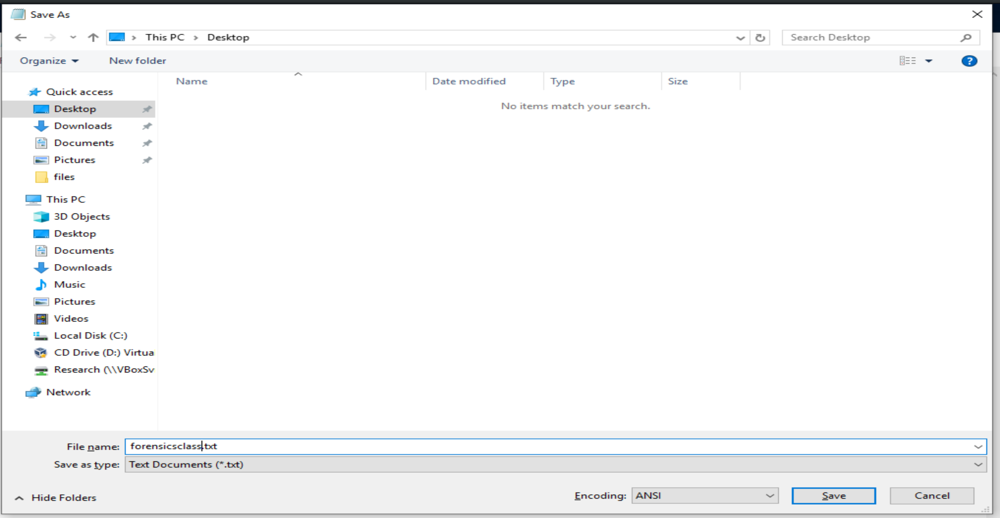
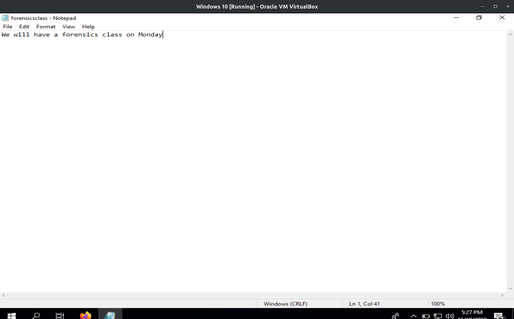
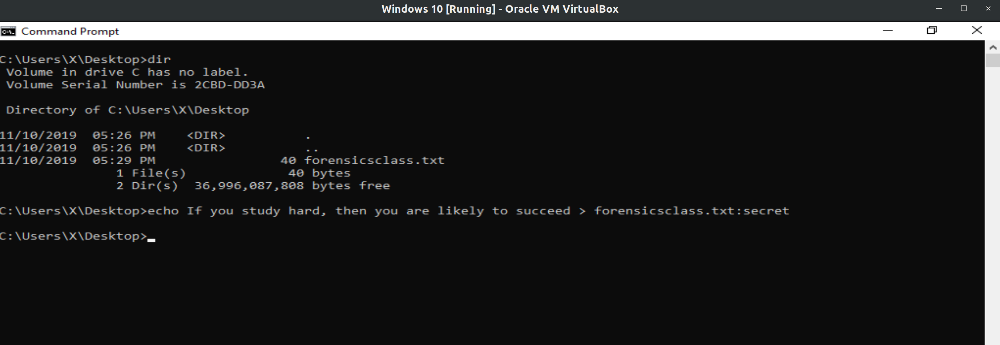
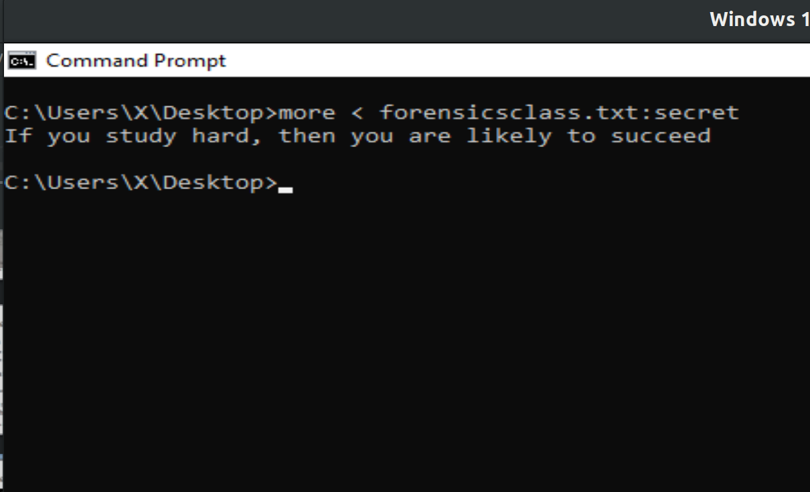
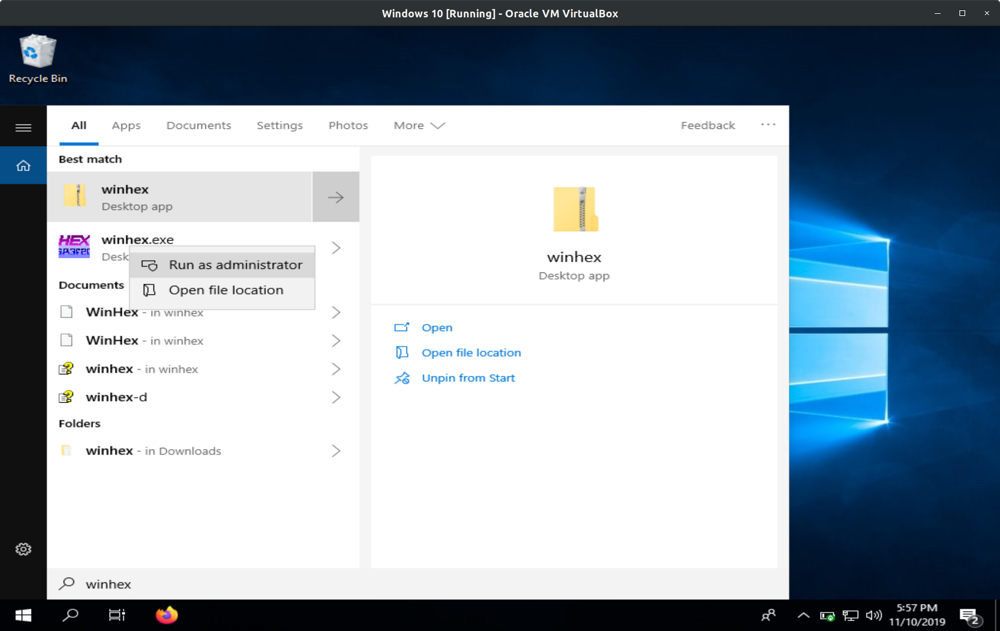
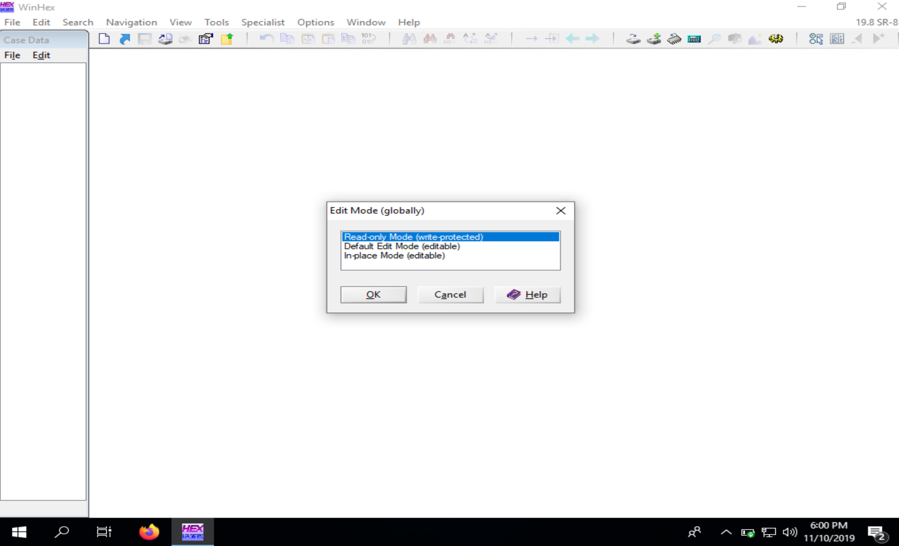
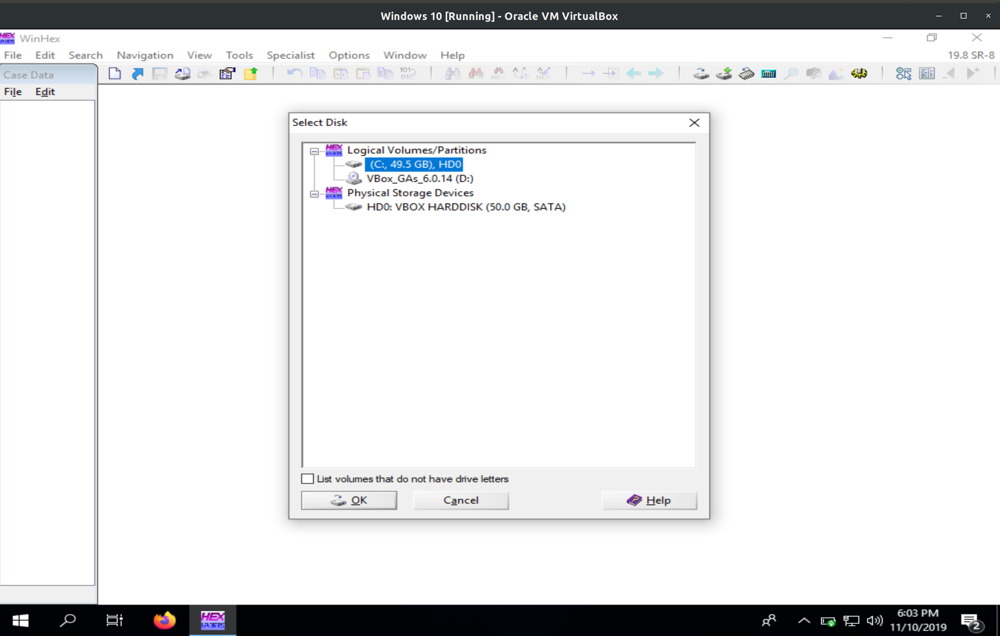
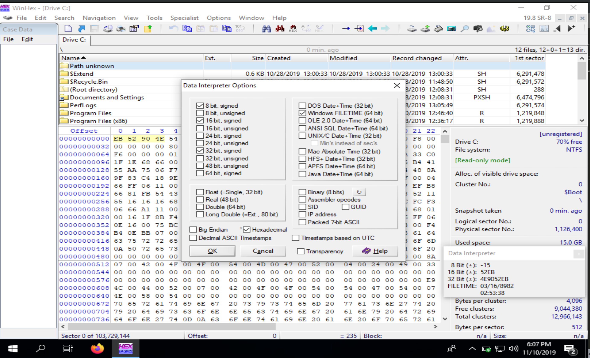
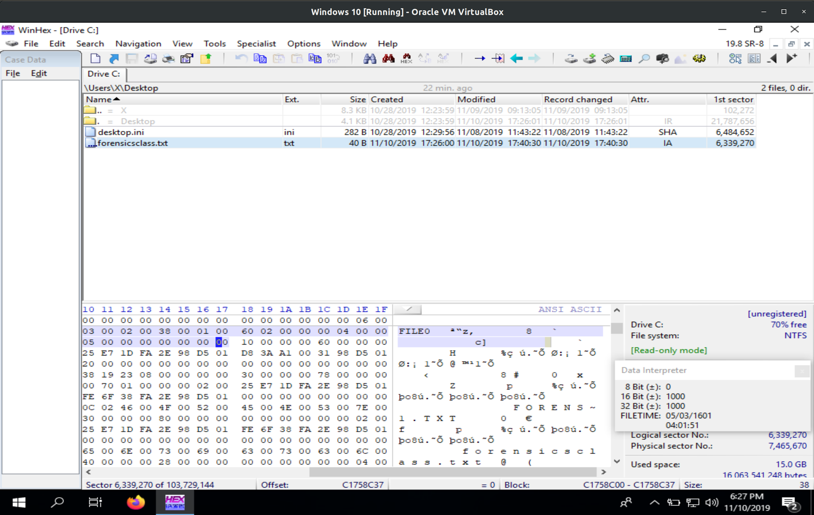

# Lab 3: Lab 3 Examining NTFS Disks
### CSC 153 - Computer Forensics Principles and Practice

## Objectives  
* Become familiar with the WinHex forensics tool.
* Use WinHex to explore the MFT and be able to analyze both resident and non-resident files.


## Part 1: Explore MFT of a file.  

To begin, we create a text file named `forensicsclass.txt` and put it on our Desktop.  
  
**Figure 1:** Create text file `forensicsclass.txt`.  

In the file, we type `We will have a forensics class on Monday`.  

  
**Figure 2:** We will have a forensics class on Monday.  

Next we append an alternate data stream containing ` If you study hard, then you are likely to succeed` to the file via the command below.

```console
echo If you study hard, then you are likely to succeed > forensicsclass.txt:secret
```  
  

  
**Figure 3:** Appending alternate data stream `secret` to `forensicsclass.txt`.  

We can now display that data stream via the command `more < forensicsclass.txt:secret`.  
  
**Figure 4:** Displaying alternate data stream `secret` for `forensicsclass.txt`.

Next,  we examine the metadata of the `forensicsclass.txt` file stored in the `$MFT` file. First we run WinHex as an administrator.  
  
**Figure 5:** Launching WinHex in administrator mode..

As safety precaution, click `Options -> Edit Mode` and select `Read-Only Mode (=write protected)` from the `Select Mode` dialog box.  
  
**Figure 6:** Set Edit Mode to Read-Only.  


To examine or disk, we click `Tools -> Open Disk` from the menu. In the View Disk dialog box we select the `C:` drive and then click OK.  
  
**Figure 7:** Selecting the `C:` drive as our disk to open.  

  
**Figure 8:** WinHex traversing the `C:` drive.  


Before we examine the disk we need to navigate to `Options -> Data Interpreter` from the menu. In the` Data Interpreter Options` dialog box, we click the `Win32 FILETIME (64 bit)` check box, shown in Figure 9, and then click OK. The Data Interpreter should then have FILETIME as an addition display item.  
  
**Figure 9:** Data Interpreter Option include `Win32 FILETIME (64 bit)`.  


Now in WinHex we need to navigate to where we saved `forensicsclass.txt` and click it.  
  
**Figure 10:** Selecting `forensicsclass.txt`.  


Next we click at the beginning of the record, on the letter `F` in `FILE,` and then drag down and to the right while monitoring the hexadecimal counter in the lower-right corner. At offset `0x38` from the beginning of the MTF record we find the start of the attribute `0x10`.   
  
**Figure 11:** Attribute `0x01` at offset `0x38` from the start of the MFT record.

The file’s create date and time can be found from offset `0x18` to `0x1F` from the beginning of attribute `0x10`. 


Use similar method as in step 7 to find the file create date and time for forensicsclass.txt. Refer to your handout for the attribute details.  


### Questions for Part 1  
1. According to the data interpreter, what is the file create date and time for the file forensicsclass.txt? Take a screenshot to prove your answer.

2. What is the size of the MFT record?

3. What is the length of the header?

4. What is the file’s last modified date and time?

5. How many 0x30 attributes does this file have? Why?

6. What is the name of this file?

7. Is this file a resident file or nonresident file? Where can you find the evidence?

8. Did you find the hidden message in the file when you check the MFT record? Take a screenshot to show the hidden message.

9. How many 0x80 attributes does this file have? What is the possible reason?