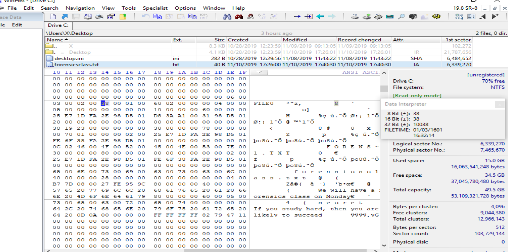
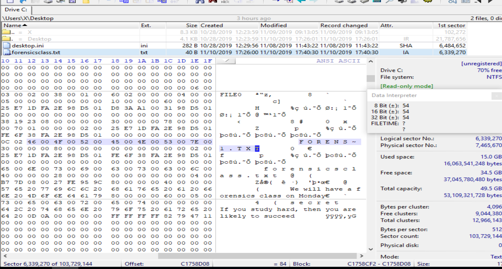
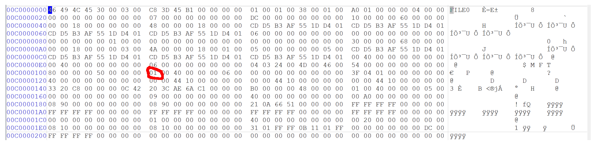
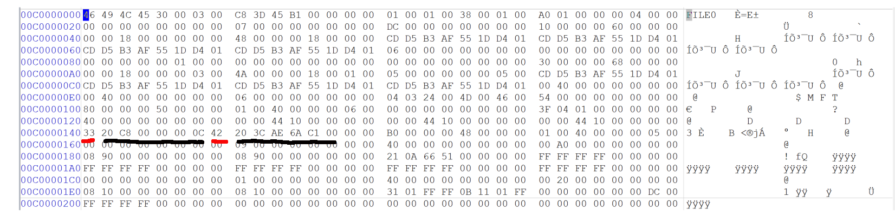
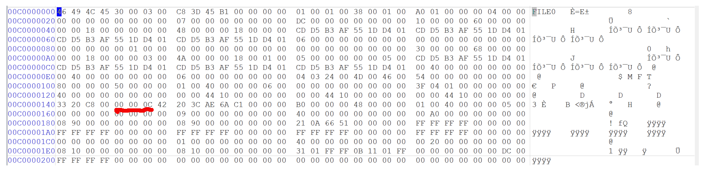
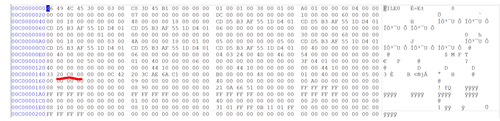
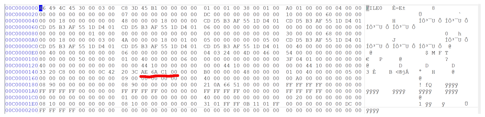
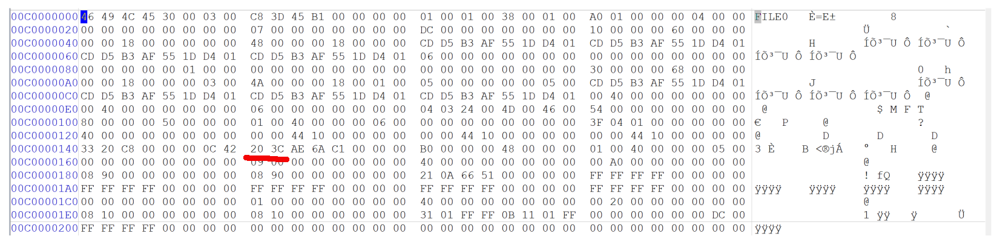

# Lab 3: Lab 3 Examining NTFS Disks
### CSC 153 - Computer Forensics Principles and Practice

## Objectives  
* Become familiar with the WinHex forensics tool.
* Use WinHex to explore the MFT and be able to analyze both resident and non-resident files.


## Part 1: Explore MFT of a file

To begin, we create a text file named `forensicsclass.txt` and put it on our Desktop.  
  
**Figure 1:** Create text file `forensicsclass.txt`.  

In the file, we type `We will have a forensics class on Monday`.  

  
**Figure 2:** We will have a forensics class on Monday.  

Next we append an alternate data stream containing ` If you study hard, then you are likely to succeed` to the file via the command below.

```console
echo If you study hard, then you are likely to succeed > forensicsclass.txt:secret
```  


  
**Figure 3:** Appending alternate data stream `secret` to `forensicsclass.txt`.  

We can now display that data stream via the command `more < forensicsclass.txt:secret`.  
  
**Figure 4:** Displaying alternate data stream `secret` for `forensicsclass.txt`.

Next,  we examine the metadata of the `forensicsclass.txt` file stored in the `$MFT` file. First we run WinHex as an administrator.  
  
**Figure 5:** Launching WinHex in administrator mode..

As safety precaution, click `Options -> Edit Mode` and select `Read-Only Mode (=write protected)` from the `Select Mode` dialog box.  
  
**Figure 6:** Set Edit Mode to Read-Only.  


To examine our disk, we click `Tools -> Open Disk` from the menu. In the View Disk dialog box we select the `C:` drive and then click OK.  
  
**Figure 7:** Selecting the `C:` drive as our disk to open.  

  
**Figure 8:** WinHex traversing the `C:` drive.  


Before we examine the disk we need to navigate to `Options -> Data Interpreter` from the menu. In the` Data Interpreter Options` dialog box, we click the `Win32 FILETIME (64 bit)` check box, shown in Figure 9, and then click OK. The Data Interpreter should then have FILETIME as an addition display item.  
  
**Figure 9:** Data Interpreter Option include `Win32 FILETIME (64 bit)`.  


Now in WinHex we need to navigate to where we saved `forensicsclass.txt` and click it.  
  
**Figure 10:** Selecting `forensicsclass.txt`.  


Next we click at the beginning of the record, on the letter `F` in `FILE,` and then drag down and to the right while monitoring the hexadecimal counter in the lower-right corner. At offset `0x38` from the beginning of the MTF record we find the start of the attribute `0x10`.   
  
**Figure 11:** Attribute `0x01` at offset `0x38` from the start of the MFT record.

The file’s created date and time can be found from offset `0x18` to `0x1F` from the beginning of attribute `0x10`.  In the same manner we used above, we can determine the files created date and time to be `11/10/19 17:26:00`.  
  
**Figure 12:** File created date and time for `forensicsclass.txt`.  


### Questions for Part 1  
1. According to the data interpreter, what is the created date and time for the file `forensicsclass.txt`?  
    * The created date and time for `forensicsclass.txt` is **11/10/19 17:26:00**. It's found from offset `0x18` to `0x1F` from the beginning of  the attribute `0x10`. It should be noted that this is with the box for `Timestamps based on UTC` selected.    
      
    **Figure 13:** File created date and time for `forensicsclass.txt`.

2. What is the size of the MFT record?
    * The size of the MTF record is, in big endian, `00 00 04 00` . We can find this information at from offset `0x1C to 0x1F` from attribute `0x00`.  
        
    **Figure 14:** The size of the MTF record for `forensicsclass.txt` is `0x0400`.

3. What is the length of the header?  
	* The header length for the MFT record is `0x38` . This can be found at offset `0x14` from attribute `0x00`.
	  
	**Figure 15:** The length of the MTF record header for `forensicsclass.txt` is `0x38`.  

4. What is the file’s last modified date and time?  
	* The file’s last modified date and time is  **11/10/19 17:26:00** . We can find that information from offset `0x20` to `0x27` of attribute `0x10`. It should be noted that this is with the box for `Timestamps based on UTC` selected.  
	  
    **Figure 16:** File last modified date and time for `forensicsclass.txt`.


5. How many `0x30` attributes does this file have? Why?  
   * There are **two** attribute `0x30`s'. This is because our file name is longer than 8 characters, so we have a **short file name**, and a **long file name**.
   *     
   **Figure 17:** The short file name at `0x5A` from the first `0x30` attribute.    
   * Long file names are found at offset `0x5A` from the **second** `0x30` attribute. Our long file name is `forensicsclass.txt`.
     
   **Figure 18:** The long file name at `0x5A` from the second `0x30` attribute.

6. What is the name of this file?
   * As stated above there are two file names, a short file name and long file name.
   * Short file names are found at offset `0x5A` from the **first** `0x30` attribute. Our short file name is `FORENS~1.TXT`.
       
   **Figure 19:** The short file name at `0x5A` from the first `0x30` attribute.    
   * Long file names are found at offset `0x5A` from the **second** `0x30` attribute. Our long file name is `forensicsclass.txt`.
     
   **Figure 20:** The long file name at `0x5A` from the second `0x30` attribute.

7. Is this file a resident file or nonresident file? Where can you find the evidence?  
	* The resident/nonresident flag exists at offset `0x08` from attribute `0x80` . In this case we can see it is a **resident file**. This makes sense because it is only `40` Bytes in size.  
	  
	**Figure 21:** The resident/non-resident flag set to `0x00`, meaning resident.


8. Did you find the hidden message in the file when you check the MFT record?   
	* Yes, it was not difficult to find the hidden message. It lies inside of a second `0x80` attribute, and is easily found by looking at the `ascii` screen on WinHex.
	  
	**Figure 22:** The secret message contained in the second `0x80` attribute.  

	* More specifically, it's located in the data run for the second `0x80` attribute at offset `0x18`.  
	  
	**Figure 23:** Secret message contained inside of the data run for the second `0x80` attribute.


9. How many `0x80` attributes does this file have? What is the possible reason?  
	* The reason for this would be the **hidden data stream**. This creates an additional `0x80` attribute for the stream. We can verify this by going to offset `0x18` for the second `0x80` attribute. This is where the data run is for resident files. This contains the secret message.  
	  
	**Figure 24:** Secret message contained inside of the data run for the second `0x80` attribute.


## Part 2: Analyze a given MFT record  

Given the MFT record below, please answer the questions from 10-15.  
  
**Figure 25:** Answer questions 10-15.  

## Questions for Part 2  

10. Is this file a resident file or nonresident file? Where can you find the evidence?  
  * The resident/nonresident flag exists at offset `0x08` from attribute `0x80` . In this case we can see it is a **nonresident file**, as the flag is `0x01`.  
    
  **Figure 26:** Nonresident file flag.

11. How many data runs does this file have?  
  * This file has *two* data runs.
    
  **Figure 27:** Bytes underlining start of data runs in red, and remainders in black.

12. What is the starting cluster address value for the first data run (LCN)?  
  * The starting cluster address value is `0x0C0000`. We multiply this by the cluster size, which is `4096` in decimal or `0x1000` in hexadecimal.  So the cluster address value for the first data run is `0x0C0000 * 0x1000 = 0xC00000000`.
    
  **Figure 28:** Starting LCN address for first data run.

13. How many clusters are assigned to the first data run?  
  * The number of clusters assigned to the first data run is `0x00C820`.  
    
  **Figure 29:** Number of clusters assigned to the first data run.

14. Does this file have other data runs? If yes, what is the starting cluster address value for the second data run (LCN)? 
	* Yes there is a second data run.  The starting cluster address value is `0x00C16AAE`. We multiply this by the cluster size, which is `4096` in decimal or `0x1000` in hexadecimal. So the cluster address value for the second data run is `0x00C16AAE * 0x1000 = 0xC16AAE0000`.   
	  
	**Figure 30:** Starting LCN address for second data run.

15. How many clusters are assigned to the second data run?  
	* The number of clusters assigned to the second data run is `0x3C20`.  
	  
	**Figure 31:** Number of clusters assigned to the second data run.

