---
title: "CSC153: Independent Project - Anti-Forensics"
author: Curtis Botonis, Ryan Kozak, Rongguang ou
date: "2019-12-04"
subject: "CSC153 Independent Project"
keywords: [CSUS, CSC153]
lang: "en"
titlepage: true
titlepage-text-color: "FFFFFF"
titlepage-color: "004E36"
titlepage-rule-color: "C4B581"
toc: true
toc-own-page: true
logo: "./images/csus.png"
logo-width: 150
...


# Project Goal  
The goal of our project was to explore and develop various anti-forensic methodologies. In other words, we were looking to apply our knowledge of computer forensics to obfuscate data and destroy data, such that other forensic analysts could not discover or recover said data during an investigation.​ ​This project was to simulate a scenario in which a suspect had advanced knowledge of computer forensics, anti-forensic tools, and how to use them.


# Tools Methodologies    
There are many tools that exist for encrypting data, as well as destroying data. For this project we chose to explore each of the tools listed below. After using each tool we examined the results using our own knowledge of forensic investigation tools and techniques. Through each iteration we were able to validate the claims each tool makes about encryption or destruction of data, as well as the proper ways to use them.  

### Anti-Forensic Tools  
* *[Veracrypt](https://www.veracrypt.fr/en/Home.html)* (Encryption)
* *[sfdisk](https://linux.die.net/man/8/sfdisk)* (Data Hiding)
* *[Eraser](https://eraser.heidi.ie/)* (Data Destruction)
* *[CCleaner](https://www.ccleaner.com/ccleaner)* (Data Destruction)

### Other Tools Utilized  
* *[dd](https://linux.die.net/man/1/dd)* (Forensic Analysis)
* *[dcfldd](http://dcfldd.sourceforge.net/)* (Forensic Analysis)
* *[OSForensics](https://www.osforensics.com/)* (Forensic Analysis)
* *[Autopsy](https://www.sleuthkit.org/autopsy/)* (Forensic Analysis)
  

## Data Obfuscation  
In this project we, we've broken down data hiding techniques into two categories, Stenography, and Cryptography. The difference between them is well explained in *Module 7 Slide 12*, quoted below.

\  
\  

* Cryptography
	* Does  not hide the communication.
	* Encodes the data to prevent eavesdroppers from understanding the content.
	* Presence of encrypted data may cause suspicions.

* Stenography
	* Hides the communication.
	* The data may or not be encrypted.
	* If they don’t know about it, how can they be suspicious?

## Data Destruction   
We were seeking ways in which to destroy data on a drive such that it cannot be recovered by a forensic analyst.  


# Scenario  

## Overview  
As a demonstration of our research, we've developed a scenario in which a suspect has used the tools and techniques described in the previous sections to hide sensitive information from investigators. We will cover in detail what the suspect has done, and then play the role of an investigator trying to find the sensitive information.  

### Sensitive Information  
The sensitive information hidden by the suspect consists of a public/private key pair used to SSH into a server determined by investigators to be used for illegal activity. There is also a secret text file, which may contain additional information about their operation. The three files are listed below.  

* id_rsa
* id_rsa.pub
* TopSecret.txt


## Encryption of Data  
To encrypt the sensitive information on the drive, we've used *[Veracrypt](https://www.veracrypt.fr/en/Home.html)*. While this tools provides a mechanism for encrypting an entire disk (demonstrated in our video), we've chosen to use an encrypted container for the purposes of this paper. This is an encrypted file, that remains static in size after its creation. This container, because it is handled as a regular file, is extremely portable. An encrypted container can be mounted and used as a typical drive using Veracrypt and the correct decryption keys.

### Hidden Volume  
As an additional measure of protection, the sensitive information stored in the encrypted container will reside on a hidden volume. The hidden volume is explained in *[Veracrypt's Documentation](https://www.veracrypt.fr/en/Hidden%20Volume.html)*, quoted below.  

>It may happen that you are forced by somebody to reveal the password to an encrypted volume. There are many situations where you cannot refuse to reveal the password (for example, due to extortion). Using a so-called hidden volume allows you to solve such situations without revealing the password to your volume. 

As you can see in Figure 1, a hidden volume uses the fact that encrypted data always appears as random data, regardless of whether or not it contains any actual information. **The difference between free space and files can only be determined once the container is decrypted.**

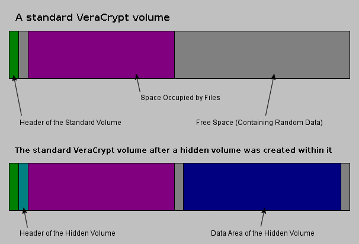  
**Figure 1:** Hidden container before and after hidden volume creation, *[source](https://www.veracrypt.fr/en/Hidden%20Volume.html)*.

The encrypted container we created was `55MB` in size, and named `emirc`.  
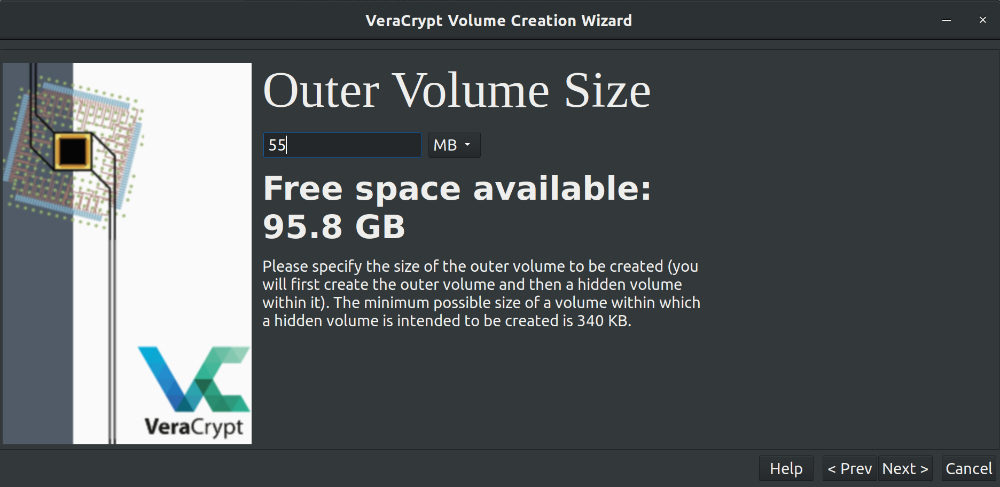  
**Figure 2:** Creating outer volume of encrypted container in VeraCrypt.  

Our hidden volume inside of the encrypted container was `26MB`.  
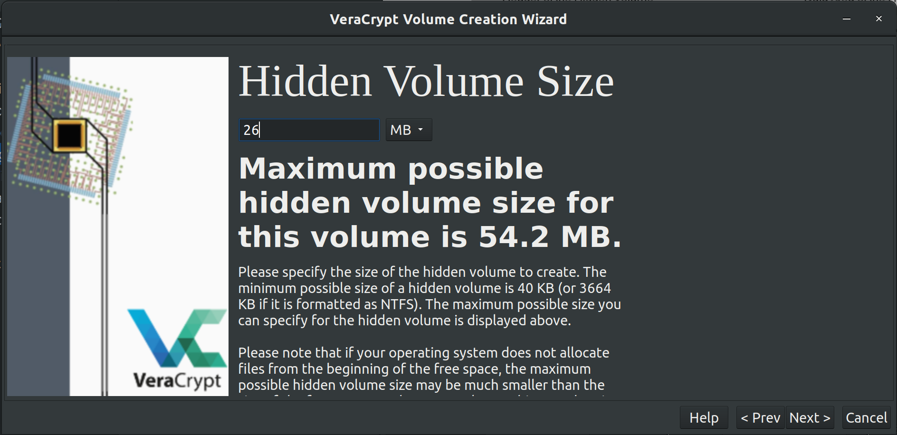  
**Figure 3:** Creating inner (hidden) volume of encrypted container in VeraCrypt.

After the creation of our hidden container, we placed decoy files inside of the outer volume. These consisted of homework pdf's from CSC153. If this encrypted container were to be discovered, the decoy key would be provided and these files would be all that is decrypted.  
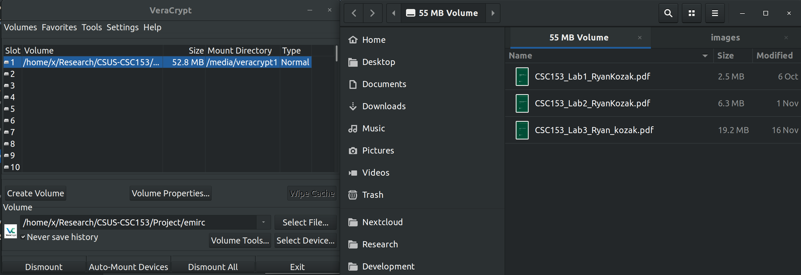  
**Figure 4:** Decoy pdf files on outer volume of encrypted container.  

The true sensitive information was placed on the inner (hidden) volume of the encrypted container, as seen in Figure 5 below.  
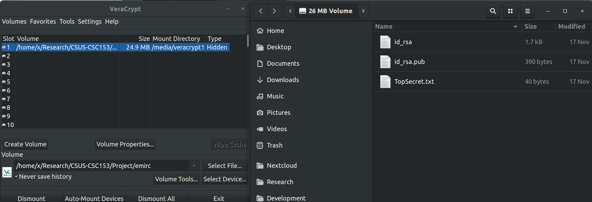
**Figure 5:** The truly sensitive information is on the inner (hidden) volume of the encrypted container.  


## Stenography 
After the creation of our encrypted container, it was hidden on a `1GB` flash drive inside of bad blocks. The goal of this was to avoid the suspicion aroused by the presence of an encrypted file. By hiding the encrypted container we've added another layer of protection, as now the flash drive appears as though it contains only harmless data.

### Hiding Data in Bad Blocks
Conceptually hiding our encrypted container inside of bad blocks is simple. We create a small partition in the middle of our drive, large enough to fit the container, and create a file system. The encrypted container is placed on that partition. We then partition the entire drive, but while writing a file system to the outer partition, we tell the file system that the blocks containing our inner partition are bad blocks. This will prevent the outer partition from seeing or using the sectors that contain the inner partition.

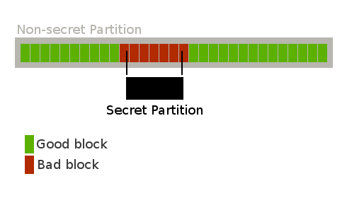  
**Figure 6:** Hiding an inner partition in bad blocks *[source](https://davidverhasselt.com/hide-data-in-bad-blocks/)*.  

The steps taken to accomplish this can be found below, and will assume the drive is `/dev/sdb`.  

0. Zero out the drive `sudo dd if=/dev/zero of=/dev/sdb status=progress`.  
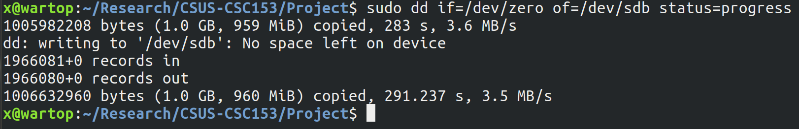  
**Figure 7:** Zero out flash drive before partitioning.  

\  

1. Create our inner partition of `56.32MB`. The starting point is sector `2630`, and it is `110000` sectors, all `512B` each.
```bash
sudo sfdisk /dev/sdb << EOF
2630,110000,6
EOF
```  
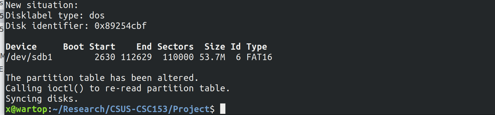  
**Figure 8:** After creating the inner partition with the command above.  

\  


2. Make a `FAT 16` file system for the inner partition.  

```bash
sudo mkfs.vfat -F 16 /dev/sdb1
```
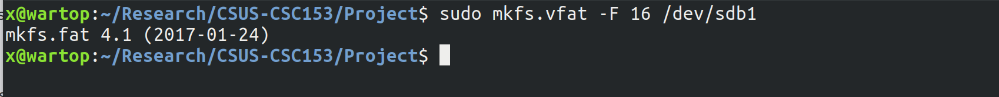  
**Figure 9:** Creating `FAT 16` file system on inner partition.  

\  

3. Place our encrypted container inside this partition.  
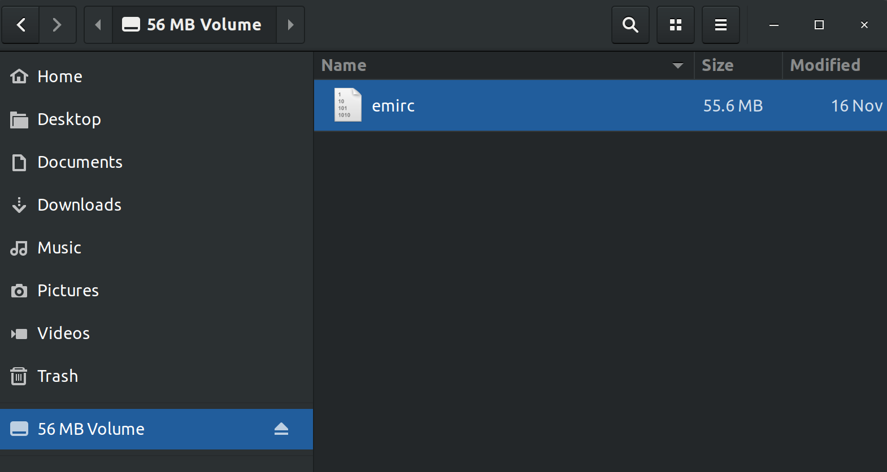  
**Figure 10:** Place `emirc` encrypted container on inner partition.  

\  
\  
\  
\  
\  
\  
\  

4. Unmount the drive via `sudo umount/dev/sdb`.  
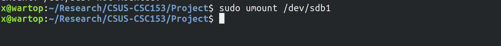  
**Figure 11:** Unmount disk before creating outer partition.

\  

5. Create an outer partition that takes up all the space on the drive. This will consume the entire inner partition.  
```bash
sudo sfdisk /dev/sdb << EOF
,,6
EOF
```  
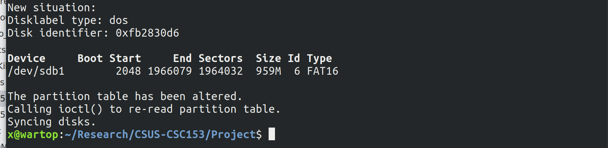  
**Figure 12:** After creating the outer partition with the command above.  

\  

6. Build a file of bad blocks, to set when creating the file system for the outer partition. In this case we will start at block `288` and go to block `58000`. Each block is `1kb`, so the size of this comes out to be about `57.7KB`. The reason that this is slightly larger than our inner partition is because we're padding the size a bit to account for any potential miscalculations.  
```bash
seq 288 58000 > /tmp/badblocks
```
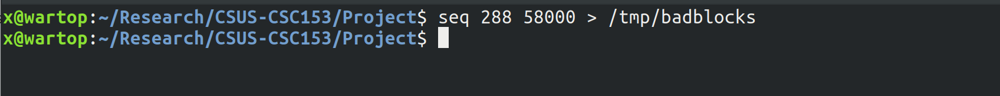  
**Figure 13:** Make bad blocks file.  

\  

7. Make a `FAT 16` file system for the outer partition, marking the blocks of the inner partition as bad. This will prevent the outer partition from using these blocks.  
```bash
sudo mkfs.vfat -F 16 -l /tmp/badblocks /dev/sdb1
```  
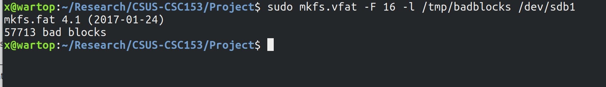  
**Figure 14:** Creating `FAT 16` file system on outer partition, marking bad blocks. 

\  

8. Fill the outer partition with harmless data.  
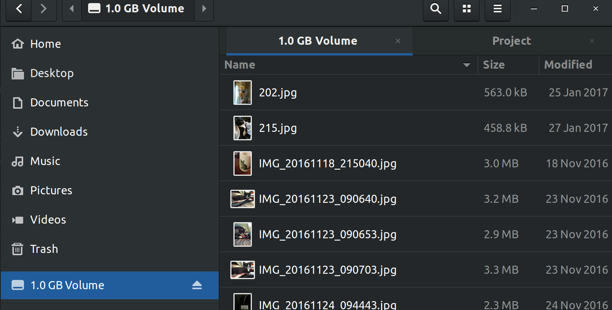  
**Figure 15:** Filled outer partition with harmless data.  


**Further Information**  
Switching between partitions to access data is simple. The hidden partition can be accessed again by unmounting the drive and using the command from step 1. To toggle to the outer partition, unmount and enter the command from step 5. Repeat those two processes as necessary.


### Analysis of Encrypted Data Hidden in Bad Blocks
We've taken an image of the drive with the outer partition mounted for a forensic analysis.  
```bash
sudo dcfldd if=/dev/sdb of=/home/x/Research/CSUS-CSC153/Project/crime.dd conv=noerror,sync hash=md5 hashwindow=0 hashlog=/home/x/Research/CSUS-CSC153/Project/crime.md5.txt
```  
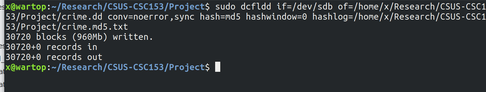  
**Figure 16:** Taking an image of the drive for a forensic analysis.  

Importing the `crime.dd` image into Autopsy does not reveal the existence of our hidden data at all. We can see from Figure 17 below, there are no files other than images found on the drive. The container `emirc` does not appear in a search for it. Obviously, since the encrypted container is not found, and remains encrypted, none of the decoy files or secret files can be seen using Autopsy.  

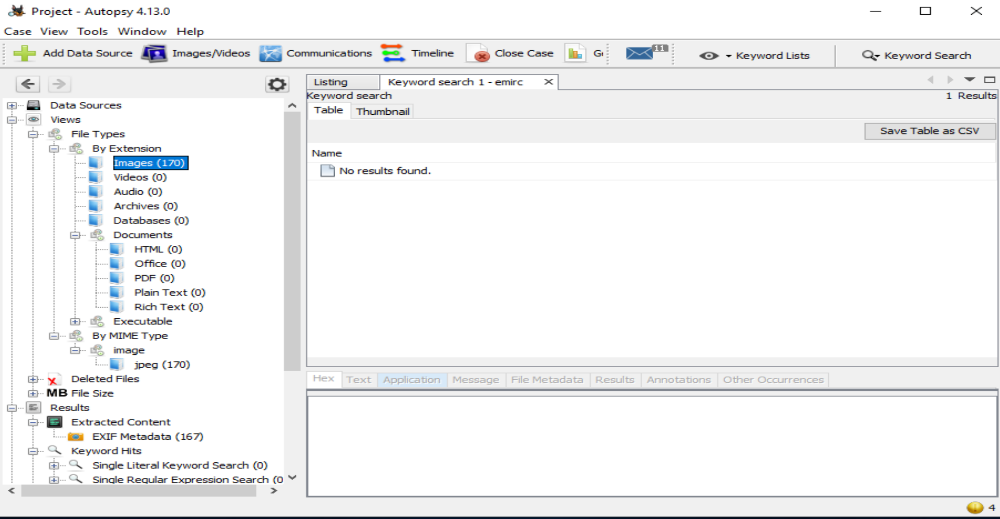  
**Figure 17:** Forensic analysis of `crime.dd` in Autopsy.


## Destroying Data  
### Linux Data Destruction with dd

To completely destroy the data on a disk using a Linux machine, we used a simple `dd` command in a loop. The script below is a snippet of `ddKillDisk.sh` which we've developed to destroy disks using `dd`. It will use `/dev/urandom` to write random data to the disk, as opposed to `/dev/zero`, which we've used in labs to zero out a disk. The reason for the loop is to ensure that there is no magnetic trace left over if we're wiping an HDD, rather than a drive with flash memory.  

```bash
#!/bin/bash
echo Enter the disk to destroy \(ex: /dev/sdb\):
read get_disk
echo Enter the number of passes \(ex: 10\):
read num_passes
for (( c = 1; c <= $num_passes; c++ ))
do
  clear
  echo =====================================================================
  echo      Disk:  $get_disk         Pass: $c
  echo =====================================================================
  sudo dd if=/dev/urandom of=$get_disk status=progress
done
echo
echo Your disk is very destroyed, have a nice day.
echo
```  

Using this script to destroy drive we've created in the steps above yields successful results.  
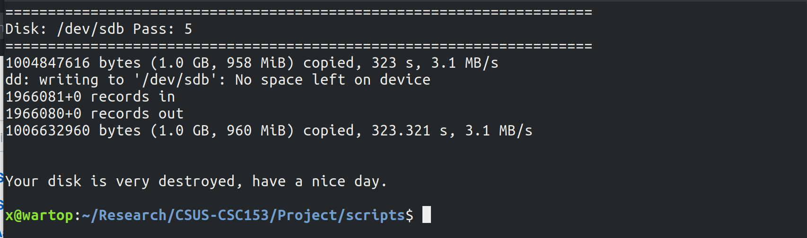  
**Figure 18:** Using the script above to destroy data on `/dev/sdb` using 5 passes.  

As you can see from Figure 19 below, after destroying the data and analyzing the disk once again in Autopsy, no files are found at all.  
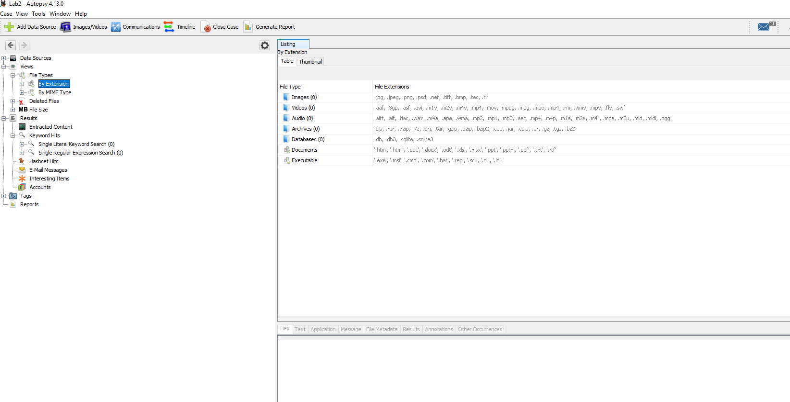  
**Figure 19:** No files found in Autopsy after running `ddKillDisk.sh`. 

### Windows Data Destruction with CClean  
For our project, we also explored a few tools to destroy data on a Windows environment. You can see in Figure 19 below that OS Forensics has information concerning the browser history.  
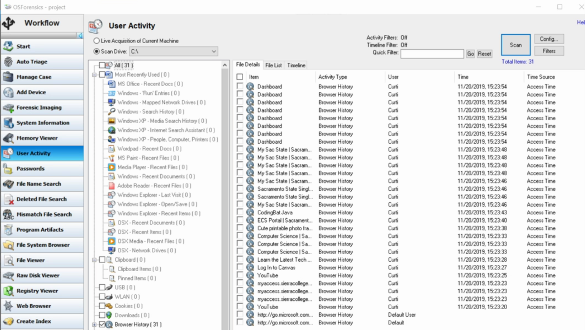  
**Figure 20:** Browser history in OS Forensics before running CClean.  

Below we're using CClean to eliminate our web browsing history on an active disk.  
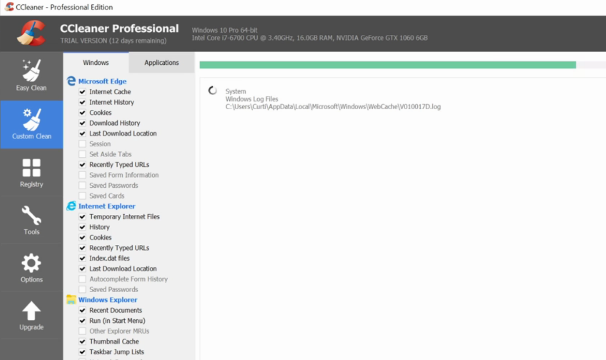  
**Figure 21:** Using CClean to destroy browser history.  

Once we've finished running CClean on our browser history we can check OS Forensics once more and see that the information from Figure 19 is no longer present in Figure 21.  
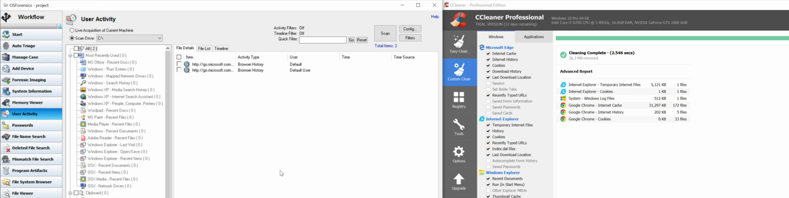  
**Figure 22:** Browser history in OS Forensics after running CClean.  

### Windows Data Destruction with Eraser  
We've determined Eraser to be an effective tool for the destruction of files in a Windows environment. The tool overwrites the data run of a file once it has been deleted in order to ensure that it cannot be found via forensic tools such as WinHex.  

To demonstrate this tool we've created three files,  

* File 1: placeholder
* File 2: delete me
* File 3: erase me  

File 1 we do not touch, and is present in all forensic tools used as a control to our experiment. File 2 we've deleted through the operating system.  
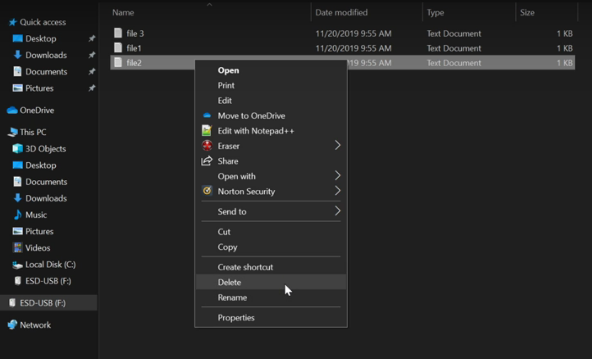  
**Figure 23:** Deleting File 2.

File 3 we've used Eraser to delete. A nice feature of Eraser is that it's available in Windows Explorer, as seen in Figure 24.  
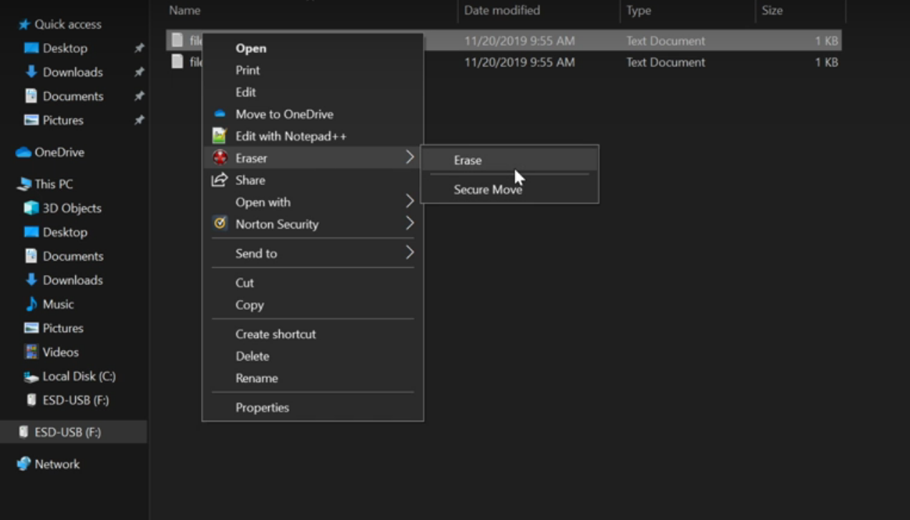  
**Figure 24:** Erasing File 3. 


When we examine examine the deleted files in OS Forensics after deleting File 2 and erasing File 2, we can see that File 3 is not present in the delete files, but File 2 is.  
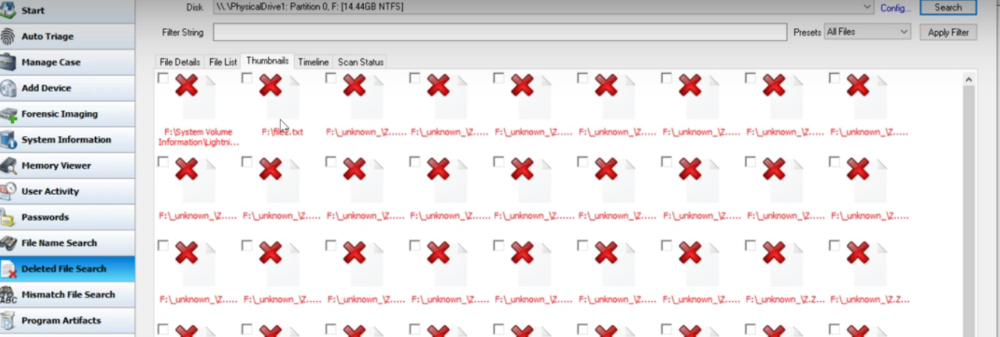  
**Figure 25:** Deleted files in OS Forensics  

Looking at the data run for File 3 in WinHex, we can see that it's been overwritten with random data.  
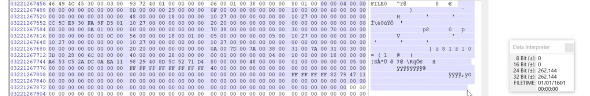  
**Figure 26:** Data run for File 3 after running Eraser on it.  

# Video  
In the interest of keeping this paper under the 20 page limit, screen shots of every individual step were not included. Our project's video contains a step by step guide to accomplish the creation of a hidden volume, how to hide data in bad blocks, and how to effectively destroy data using CClean and Eraser.

See Our Video **[Here](VIDEO LINK GO HERE OK!)**

# Conclusion  
Through the combination of Encryption and Stenography we've developed an effective method for hiding data from forensic analysts. Our encrypted files do not appear to exist at all on the drive, but if they were to be discovered, the additional protection of a hidden volume allows us to provide a decoy key. The decoy data will serve the purpose of granting us plausible deniability, as there is still no way to determine the secret data exists as well. 


We have also demonstrated a few tools (OS Forensics and Eraser) that can be useful for anti-forensic practices on a Windows machine. These tools can be used while the operating system is active, and effectively destroy desired data.  

# References

1. *[Veracrypt Documentation](https://www.veracrypt.fr/en/Documentation.html)*
2. *[davidverhasselt.com](https://davidverhasselt.com/hide-data-in-bad-blocks/)*
3. *[dd Man Page](https://linux.die.net/man/1/dd)*
4. *[dcfldd Repository](http://dcfldd.sourceforge.net/)*
5. *[OSForensics](https://www.osforensics.com/)*
6. *[Autopsy](https://www.sleuthkit.org/autopsy/)*